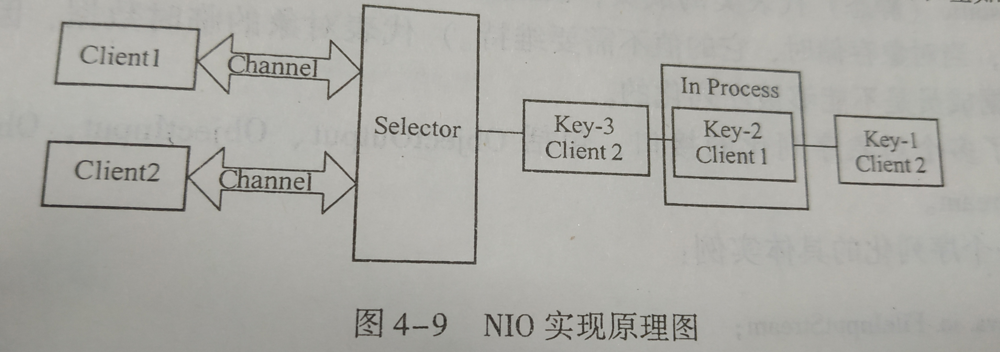

# 反射

## 定义/作用

可以在运行时期检查Java信息的一种机制


## 优势

- 增加程序的灵活性
- 提高代码的复用率


## 劣势

- 相较直接调用，在量大的情景下反射性能下降（解析字节码，然后JVM无法优化）
- 存在一些内部暴露和安全隐患


## 获取Class类的方法

```
1.Class.forName("类的路径")
2.类名.Class
3.实例.getClass
```


## 创建对象的方法

```java
1.通过new语句实例化一个对象
2.通过反射机制创建对象
3.通过clone方法创建对象
4.通过反序列化的方式创建对象
```


## 底层

class对象里面有一个内部类，专门用来存储fields，methods，constructors，这些东西本质是字节码文件，这些method里面全是native方法。然后给她撤类加载器，双亲委派。


# 异常


## Error和Exception区别

Error代表在运行期间发生了很严重的错误，且无法恢复，如OOMError,StackOverFlowError

异常多是逻辑出错，是可被捕捉的，异常又分为编译异常和运行异常，编译异常是要求你必须捕获或者抛出，运行时异常不做要求


# Java语言优点

1. 纯面向对象语言
2. 平台无关系
3. 内置了很多库
4. 提供了Web应用开发的支持
5. 较好的安全性和健壮性


# 面向对象和面向过程的区别

1. 

   面向对象用常规思维将现实世界抽象为一个个对象

   面向过程是将过程抽象化和模块化，以过程为中心处理问题

2. 

   面向对象易维护、易扩展，但是性能相比面向过程低

   


# Java和C++异同

**相同点：**都是面向对象的语言，都使用了面向对象的思想

**不同点**：

1. Java是解释性语言。源程序代码经过Java编译器编译成字节码，然后由JVM解释执行
2. Java是纯面向对象语言，所有代码必须在类中实现。
3. Java语言没有指针的概念，有效的防止了C/C++语言中操作指针可能引起的系统问题
4. Java不支持多重继承，但是引入了接口概念，可以同时实现多个接口
5. Java提供了垃圾回收期实现垃圾自动回收，不需要程序显式地管理内存的分配
6. 平台无关性


# Java是如何实现平台无关性的

主要是靠“字节码”和“Java虚拟机”

Java程序被编译后不是生成能在硬件平台上可执行的代码，而是生成了字节码，然后JVM把字节码翻译成硬件平台能执行的代码


# Main方法

1. public跟static没有先后顺序关系
2. 可以用final修饰，但不能有abstract修饰
3. 用synchronized修饰
4. 一个java文件可以有多个main方法（在多个类中），但只有与文件名一致的类的main方法才是程序的入口


# Java程序初始化顺序

1. 静态属性：static 开头定义的属性

2. 静态方法块： static {} 圈起来的方法块

3. 普通属性： 未带static定义的属性

4. 普通方法块： {} 圈起来的方法块

5. 构造函数： 类名相同的方法

6. 方法： 普通方法

   总结：

   静态对象（变量）优先于非静态对象（变量）

   父类优先于子类进行初始化

   按照成员变量定义顺序进行初始化

```java
class Base{
    static {System.out.println("base static block"); }

    {  System.out.println("base block"); }

    Base(){
        System.out.println("base constructor");
    }

}


public class Test extends Base{

    static { System.out.println("test static block"); }

    {     System.out.println("test block"); }
    
    Test(){
        System.out.println("test constructor");
    }
    
    public static void main(String[] args) {
        new Test();
    }
}
/*
运行结果
base static block
test static block
base block
base constructor
test block
test constructor
*/
```


# 变量权限修饰词

|               | 类内 | 同一包下 | 子类 | 其他包 |
| :-----------: | :--: | :------: | :--: | :----: |
|    public     |  √   |    √     |  √   |   √    |
|   protected   |  √   |    √     |  √   |        |
| default(默认) |  √   |    √     |      |        |
|    private    |  √   |          |      |        |


# 构造函数

1. 构造函数必须与类名相同，并且不能有返回值
2. 一个类可以有多个构造函数
3. 当没有构造器，编译器会为类提供一个默认无参数的构造函数
4. 构造函数可以没有参数也可以有多个参数
5. 构造函数是伴随NEW操作一起被调用的，主要是完成了对象的初始化工作
6. 构造函数不能被继承
7. 子类可以通过super来显式调用父类构造器


# Java实现C语言函数指针的方法

先定义一个接口，接口中设定好预先定义的方法。

然后写一个类，继承这个接口


# 继承特性

1. 不支持多继承
2. 子类只能继承父类的私有成员变量与方法
3. （方法）重写
4. 变量覆盖

  

# 抽象类和接口异同

抽象类：如果一个类中包含抽象方法，那么这个类就是抽象类

​		

**同：**

1. 都不能被实例化
2. 接口的实现类或者抽象类的子类必须实现对应的方法后才能实例


**异：**

1. 接口所有方法都只能定义不能实现，抽象类除了抽象方法都是可以实现的

2. 接口实现是用implement,抽象类继承是用extends

3. 接口更强调“has a”，抽象类强调“is a”

4. 接口变量只能被static final修饰（默认是这样，即使没写也是），方法也只能用public和abstract修饰

   而抽象类实现的时候必须用相同或者更低的访问权限

​              


# 内部类

分类：

1. 静态内部类

   可以不依赖外部类实例而被实例化，不能和外部类一样的名字，只能访问外部类中的静态成员和静态方法

2. 成员内部类

   只有在外部类被实例化后才能被实例化，可以自由访问外部类的变量和方法，但是不能定义静态变量和方法

3. 局部内部类（在类的方法里面新定义了一个类）

   不能被public、protected、private以及static修饰，只能访问方法中被定义为final类型的变量

4. 匿名内部类


总结：

​		非静态内部类不能定义静态成员

​		静态内部类不能访问外部的非静态成员


# 获取父类类名

Java提供了获取类名的方法：先获取Class类然后再调用getName()方法


**然而，这不适合于获取父类，原因在于所有类都继承自Object类，getClass()方法在Object类中被定义为final和native，子类不能覆盖该方法。
this.getClass()和super.getClass()最终调用的都是Object里的getClass()方法
而Object的getClass（）方法的实质是，返回此Object的运行时类
如果要得到父类名可以通过反射机制,使用getClass().getSuperClass().getName()**

```java
class A { }

public class Test extends A {

    public void test(){
        System.out.println(this.getClass().getSuperclass().getName());
    }
    
    public static void main(String[] args) {
        new Test().test();
    }
}
//输出结果：A
```


# this与super

this指向当前实例对象，经常用于区分对象的成员变量和方法的形参

super可以访问父类的方法或者成员变量，当子类的变量方法跟父类变量方法一致时，就会产生覆盖现象，此时如果想调用父类的方法和变量，那么只能用super关键字。**并且，子类如果想调用父类构造器，必须在子类的构造器的第一条语句调用**


# final

final可用于修饰属性，方法，类，分别表示属性不可变（对于引用类型是指向不变，不关心对象内容是否改变），方法不可覆盖，类不可被继承


# assert

软件调试方法，提供了一种在代码中进行正确性检查的机制

```java
/*
有两种格式:
第一种：assert 表达式
第二种：assert 表达式1：表达式2                   
*/
```


# static

1. 为变量提供单一的的存储空间
2. 实现某个方法或属性与类而不是对象关联在一起
3. 静态方法中不能使用this,super关键字，不能调用非static方法，变量
4. 不能在成员函数内部定义static变量


# instanceof

判断一个引用类型的变量所指向的对象是否是某个类的实例


# 类型转换

1. 类型自动转换

   低级数据类型自动转换为高级数据类型

   其中，

   - char类型转换为高级类型（int,long等），会转换为其对应的ASCII码

   - byte,char,short类型的数据在参与运算时会自动转换成int,但在使用“+=”时候不会产生类型转换

   - 基本类型和不二类型不能产生互换

     ```java
     short s1=1;
     s1=s1+1;//会出错
     s1+=1;  //不会出错，因为编译器对其进行特殊处理了
     ```

2. 强制类型转换

   高级类型转换成低级类型，需要强制转换


# char汉字问题

char默认采用unicode,每个字占2个字节，可以用来存储中文

String是由char数组构造成的，但是它采用了更加灵活的方式，英语用1个字符，中文2个字符


# 字符串引用问题

```
new String("123")==new String("123");
String a="123";
String b="123";
a==b;
/*
输出结果：false,true
原因在于，==对于引用类型，是比较地址，只要用new会生成新的对象，地址就不一样
		"123"会从常量池从找出相同的字符串（所以还是同一个对象，地址自然也是相同的）
		
new String("123");
创建的对象有可能是一个也有可能是2个，如果常量池中有就是1个，没有就是2个		
*/
```


# 字符串如何制定编码

```
String str = new String("test");
String result = new String(str.getBytes("ISO-8859-1"),"GBK")
```


# String、StringBuffer、StringBuilder区别

1. String不可变，其他2个可变
2. StringBuilder不是线程安全的，StringBuffer是
3. 执行效率方面，StringBuilder>StringBuffer>String


# 数组

JAVA中的数组也是一种对象（instanceof 证明）

二维数组是由一维数组嵌套而成的，可以每一行的数目不同


# 什么时候finally里面的内容不会被执行到

1. 压根就没进入try,catch,finally体系，在那之前就出错了
2. 强制退出程序System.exit(0);
3. 所在线程是守护线程                    （有可能不会被执行到，在《并发编程的艺术》里面有讲到）


# IO流实现机制

在JAVA中，根据处理数据类型的不同，可以分为两大类，字节流和字符流

字节流以字节为单位，包含两个抽象类，InputStream和OutputStream

字符流以字符为单位，包含两个抽象类，Reader和Writer，用到了缓存


# 管理文件和目录的类

|         方法          |                             作用                             |
| :-------------------: | :----------------------------------------------------------: |
| File(String pathname) |                 根据指定路径创建一个File对象                 |
|   createNewFile（）   | 若目录或文件存在在，则返回false,否则创建文件或文件夹，并返回true |
|       delete()        |                       删除文件或文件夹                       |
|       isFile()        |                 判断这个对象表示的是否是文件                 |
|     isDirectory()     |                判断这个对象表示的是否是文件夹                |
|      listFiles()      |        若对象代表目录，则返回目录中所有文件的File对象        |
|        mkdir()        |                   根据对象指定路径创建目录                   |
|       exists()        |                  判断对象对应的文件是否存在                  |


# NIO

NIO通过Selector、Channel和Buffer来实现非阻塞式

采用了“反应器”的设计模式，用来处理多个事件源



​	Channel是一个双向的非阻塞通道，在通道两端都可以进行数据读写操作。

​	Selector实现了一个线程来管理多个线程，采用了复用与解复用的方式使得一个线程能够管理多个通道，即可以把多个流合并成一个流，或者把一个流分成多个流的方法。在实现时，吧需要处理的Channel的IO事件注册给Selector。

​	Buffer用来保存数据，可以存放从Channel1读取的数据，也可以存放使用Channel1进行发送的数据。


```
							Selector实现原理
对所有注册的Channel进行轮询访问，一旦轮询到一个Channel1有注册时间发生，比如有数据来了，它就通过传回SelectionKey通知开发人员对Channel1进行数据的读或写操作。

Key封装一个特定Channel1和一个特定selector之间的关系。
这种轮询的方式在处理多线程请求不需要上下文的切换，所以有较高的执行效率
```


# 什么是Java序列化/持久化

## 定义

一种将对象以一连串的字节描述的过程，用于解决在对对象流进行读写操作时所引发的问题。


## 作用

实现对象持久化

序列化可以把对象的状态写在流中进行网络传输，或者保存到文件、数据库等系统里，并在需要时把该流读取出来重新构造一个相同的对象。


## 实现方法

1. 实现Serializable接口（位于java.lang包中），然后手动指定一个序列版本号ID
2. 使用一个输出流构造一个ObjectOutputStream，也就是对象流对象，紧接着，使用该对象的writeObject方法将对象写出，要恢复的时候就使用对应的输入流


## 特点

1. 如果类能被序列化，那么子类也能被序列化
2. 但是对于static类成员，transient变量是不能够被序列化的


## 使用场景

1. 需要通过网络来发送对象，或者对象的状态需要被持久化到数据库或者文件中
2. 序列化能实现深复制


## 使用自定义序列版本号ID的优点

1. 提高程序运行效率

   ```
   如果未显示指定，那么在序列化的时候需要计算得到，显示指定省去了计算步骤
   ```

2. 提高程序在不同平台上的兼容性

   ```
   不同平台计算序列版本号ID的方式可能不同，如果没有显示指定，那在一个平台序列化的对象到了另一个平台可能无法反序列化。
   ```

3. 增强程序各个版本的可兼容性

   ```
   不显示指定序列号ID，那么每次对类进行修改，对应的ID也不一样，而显示指定大大增加了程序版本兼容性
   ```

   


## 反序列化

能够将流转换为对象


## 外部序列化

需要自己编写读写方法，但是可以实现只序列化部分属性


## 只序列化部分属性的方法

1. 使用外部序列化
2. 使用transient或static修饰


