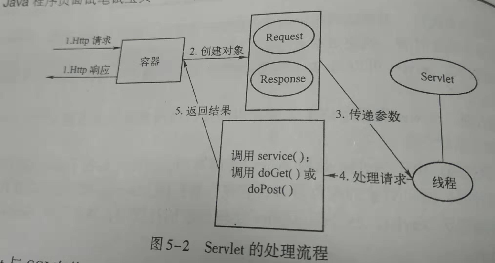

# 什么是Servlet

Servlet是采用JAVA语言编写的服务端程序，运行于Web服务器中的Servlet容器中，主要功能是提供了请求/响应服务模式，可以生成动态的Web内容


# Servlet处理请求步骤

1. 用户单击一个链接向Servlet发起请求
2. Web服务器接收到请求后，会把请求交给相应的容器处理，当容器发现这是Servlet发起的请求后，会创建两个对象：HttpServletResponse和HttpServletRequest
3. 容器可以根据请求消息中的URL消息找到对应的Servlet，然后针对该请求创建一个单独的线程，同时把之前说的两个对象以参数的形式传递到新创建的线程中去
4. 容器调用Servlet的service()方法来完成对用户请求的相应，service()方法会调用doPost()或doGet()方法来完成具体的相应任务，同时把生成的动态页面返回给容器
5. 容器把相应消息组装成HTTP格式返回给客户端。此时，这个线程运行结束，同时删除了之前创建的2个对象




# 什么是Servlet的生命周期

servlet的生命周期都是由容器来控制的

大致分为加载、创建、初始化、处理客户请求和卸载

1. 加载。

   ```
   容器通过类加载器使用Servlet类对应的文件来加载Servlet
   ```

2. 创建。

   ```
   通过调用Servlet的构造函数来创建一个Servlet实例
   ```

3. 初始化。

   ```
   通过调用Servlet的init()方法来完成初始化工作，这个方法是在Servlet已被创建但向客户端提供服务之前调用的，并且该方法只会被调用一次
   ```

4. 处理客户请求。

   ```
   Servlet一旦被创建后，它就可以为客户端提供服务了。每当有新的客户请求到来时，容器都会创建一个新的线程来处理该请求，接着会调用Servlet的service方法来完成客户端请求，当然service方法会根据请求的method属性值的不同调用决定是调用doGet方法还是doPost方法来完成具体的响应
   ```

5. 卸载。

   ```
   容器在卸载Servlet之前需要调用destory方法，让Servlet自己释放其占用的系统资源，一旦destory方法被调用，容器就不会再向这个Servlet发送任何请求消息了。如果容器需要这个Servlet，那么需要重新创建并初始化一个实例，并且destory方法只会被执行一次
   ```


# Filter是什么

顾名思义过滤器，能在request到达servlet前进行预处理，能在离开时处理response


​    