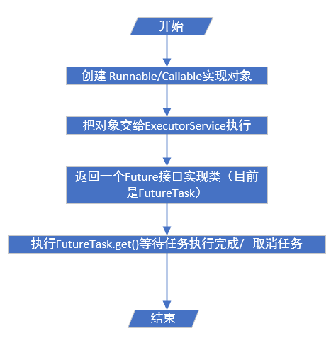
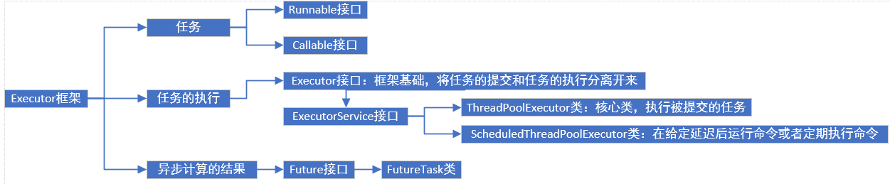

# 为什么使用

JAVA可以使用线程来异步执行任务，但是线程的创建和消费需要开销，而JAVA线程既是工作单元，也是执行机制

# 两层调度模型

JAVA里的线程被一对一的映射成为本地操作系统线程

上层

​	JAVA多线程程序将应用分解为若干个任务，然后用Executor框架将任务映射成为固定数量的线程

底层

​	操作系统内核将这些线程隐射到硬件处理器中

# Runnable 接口和Callable接口

Runnable接口和Callable接口的实现类，都可以被ThreadPoolExecutor或ScheduledThreadPoolExecutor执行

区别在于Runnable不会返回结果，可以Callable可以返回结果,call方法可以抛出异常，但是run方法不行

除了可以创建Callable接口的对象外，也可以用工厂类将Runnable封装成一个Callable

# ExecutorService

均由工厂类Executors创建，Executor核心类是ThreadPoolExecutor，他是线程池的实现类

corePool:核心线程池的大小

maximumPool:最大线程池的大小

BlockingQueue：用来暂时保存任务的工作队列

RejectedExecutionHandler：当ThreadPoolExecutor已经关闭或者ThreadPoolExecutor已经饱和时候调用的策略

| 大类                        | 小类                          | 描述                                                         |
| --------------------------- | ----------------------------- | ------------------------------------------------------------ |
| ThreadPoolExcutor           | FixedThreadPool               | 使用固定线程数，适用于满足资源管理的需求，而需要限制当前限制数量的应用场景，适用于负载比较重的服务 |
|                             | SingleThreadExecutor          | 使用单个线程，适用于需要保证顺序地执行各个任务，并且在任意时间点，不会有多个线程是活动的应用场景 |
|                             | CachedThreadPool              | 根据需要创建新线程，使用于执行很多的短期异步任务的小程序，或者是负载较轻的服务器 |
| ScheduledThreadPoolExecutor | ScheduledThreadPoolExecutor   | 创建固定线程，适用于很多个后台线程执行周期任务，同时为了满足资源管理的需求而需要限制后台线程的数量的应用场景 |
|                             | SingleThreadScheduledExecutor | 单个线程，适用于需要单个后台线程执行周期任务，同时需要保证顺序地执行各个任务的场景 |

## FixedThreadPool

可重用固定线程数的线程池

其中核心线程池大小和最大线程池大小都被设置为创建时候的nThreads

keepAliveTime:多余的空闲线程等待新任务的最长时间

使用无界队列LinkedBlockingQueue为工作队列，有如下影响：

①线程池的线程数不会超过核心线程池大小

②最大线程池大小（无界队列）和keepalivetime(默认设置为0)是无效的

③不会拒绝任务

## SingleThreadExecutor

核心线程池大小和最大线程池大小都被设置为1，其他参数相同

使用的工作队列：LinkedBlockingQueue

影响上同

①如果线程池中没有运行的线程，就创建一个新线程来执行任务

②在线程池完成预热之后，将任务加入LinkedBlockingQueue

③线程执行完任务后，会在循环中反复中工作队列中取任务来执行

## CachedThreadPool

会根据需要创建新线程的线程池

核心线程池大小被设置为0，最大线程池大小被设置为整形最大值

使用SynchronousQueue作为线程池工作队列

KeepAliveTime为60秒

如果主线程提交任务的速度高于线程池中线程处理任务的速度时，CachedThreadPool会不断创建新线程，极端情况下会因为创建过多线程而耗尽CPU和内存资源

①首先执行工作队列入队操作。如果最大线程池里面有空闲线程在执行出队操作，那么出队和出队操作匹配，主线程把任务交给空闲线程执行，execute()方法执行完成，否则执行第二步

②当最大线程池为空或者没有空闲线程的时候，就不会执行出队操作，那么步骤1就会失败。这时就会新创建一个线程来执行任务，execute()方法执行完成

③在②中新线程执行完任务后，就会执行出队操作，这个出队操作最多让空闲线程等待60秒

## ScheduledThreadPoolExecutor

### 工作过程

DelayQueue，无界队列，因此最大线程池大小无作用

执行过程：

①调用ScheduledThreadPoolExecutor的scheduleAtFixedRate()方法或者scheduleWithFixedDelay方法时，会向工作中添加一个ScheduledFutureTask

②线程池中的线程从DelayQueue中获取ScheduledFutureTask，然后执行任务

### 实现

待调度任务ScheduledFutureTask包含3个成员变量

| 成员变量             | 作用                                          |
| -------------------- | --------------------------------------------- |
| long型time           | 任务将被执行的具体时间                        |
| long型sequenceNumber | 任务添加到ScheduledThreadPoolExecutor中的序号 |
| long型period         | 任务执行的间隔周期                            |

DelayQueue封装了一个PriorityQueue，会对队列中的待调度任务进行排序，time小的排在前面，如果两个待调度任务的时间相同就比较先提交的顺序

### 获取任务的步骤

①获取锁

②获取周期任务，其中

​	2.1如果优先队列为空，那么当前线程到Condition中等待，否则就执行2.2

​	2.2如果优先队列的头元素的time时间比当前时间大，到Condition中等待time时间，否则执行2.3

​	2.3获取优先队列的头元素，如果优先队列不为空，那么唤醒Condition中的所有等待线程

③释放锁

### 添加任务步骤

1. 获取锁
2. 添加任务
   - 向优先队列里添加任务
   - 如果添加的是头元素，那么唤醒Condition里的所有线程
3. 释放锁

# Future接口

FutureTask除了实现了Future接口外，还实现了Runnable接口。

### FutureTask状态

未启动->已启动->已完成（正常结束、取消结束、异常结束）

未完成时，调用FutureTask.get()会导致调用线程阻塞

已完成时，执行FutureTask.get()会导致调用线程立即返回结果或者抛出异常

未启动时，调用FutureTask.cancel()将导致任务永远不会执行

已启动时，调用FutureTask.cancel(true)将会以中断停止任务，若调用FutureTask.cancel(false)则不会产生影响

已完成时，调用cancel都会返回false

### FutureTask的使用

可以把FutureTask交给Executor执行

也可以通过ExecutorService.submit()方法返回futuretask然后再执行get方法获取cancel方法

更可以，单独使用FutureTask

当一个线程需要等待另一个线程把某个任务执行完它才能继续执行，就可以使用FutureTask

### 基于AQS的同步器基本操作

1.至少一个acquire操作。这个操作阻塞调用线程，直到AQS的状态允许线程继续执行

2.至少一个release操作。这个操作改变AQS状态

# Quartz

原生的JDK和spring的配置都是存在内存里的，而quartz是存在数据库中

