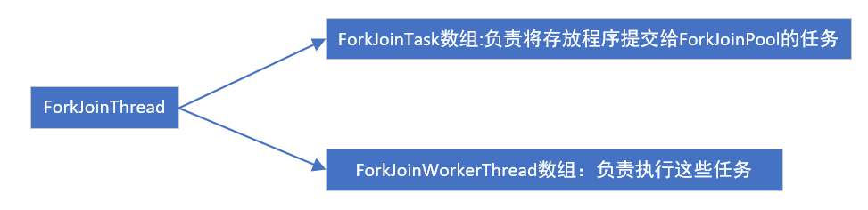

# HashMap

默认初始长度为16

负载因子0.75

当链表长度大于8就会自动转换为红黑树

每次扩展，长度都是2的幂，因为2的幂-1所有的位都是1，降低了碰撞几率

公式是：index=(len-1)&hashcode(key)

扩容是插入元素后判断元素是否已经到达容量

jdk1.7

环的形成全过程：

1. 假设一个哈希表，数组某个位置有链表3-2-null,再放一个值就需要扩容

2. AB线程同时要往哈希表放值，A线程扩容的时候执行到第一步，也就是仅仅知道当前节点指针是3，下一节点指针是2

3. 就轮到B线程执行了，B线程完成扩容操作后，由于是头插法，现在他们的顺序变成2-3-null

4. 现在轮到A继续，

   执行把3放到新表操作，当前节点指针变成2，下一节点指针也是2，本轮循环结束

5. 第二轮循环，用头插法将2插到3的前面

6. 第三轮循环，有当前节点为3，下一节点为NULL，继续使用头插法，将2指为3的下一位置，

   但是又有2的下一位置是3，所以出现了环形
   
   

头插法导致之前链表倒置，所以第一个线程完成链表倒置，第二个线程一开始保留链表正向的顺序，后来得到的是链表倒置之后的顺序，就会导致死循环

jdk1.8去除成环的方法：头插法改尾插法

# HashTable

使用synchronized来保证线程安全，当一个线程访问HashTable的同步方法，其他线程也访问HashTable的同步方法适合，就会进入阻塞或者轮询状态，对每个方法都进行了synchronized

# jdk1.7 ConcurrentHashMap

锁分段技术，每一把锁用于锁容器其中一部分数据，那么当多线程访问容器不同数据段的数据适合，线程之间就不会存在竞争问题，从而可以有效地提高并发访问效率

## 初始化

concurrencyLevel=并发数量，默认concurrencyLevel等于16

segment数组的长度ssize是由concurrencyLevel计算得到的，大于concurrencyLevel的最小的2的N次方。

sshift等于ssize从1向左移位的次数

段偏移量segmentShift等于32-sshift   //32是因为hash()方法输出的最大数是32位

段掩码segmentMask=ssize-1

## 定位

利用二次哈希法，减少冲突和提高并发效率

先经过一次再散列，然后用这个散列值通过散列运算定位到Segment,再通过散列运算定位到元素

定位segment：取哈希值的高（32-段偏移）位，然后跟段掩码做位于运算

定位hashentry: hash&(len-1) //跟hashmap一样

## get操作

get过程不需要加锁，除非读到的值是空才会加锁重读

不需要加锁的原因，segment大小的count,Entry类的value,next都是用volatile修饰，保证了获取时的可见性

(happen before原则，对volatile字段的写操作先于读操作)

## put操作

需要加锁

步骤：

①插入前，判断是否需要对segment里的hashentry数组扩容

②定位添加元素的位置，然后将其放在HashEntry数组里

## size操作

先尝试2次不加锁方式来统计各个segment大小，如果两次数量不一样，则再采用加锁的方式来统计所有segment的大小

# ConcurrentHashMap 1.7和1.8的区别

## 1、整体结构

1.7：Segment + HashEntry + Unsafe

1.8: 移除Segment，使锁的粒度更小，Synchronized + CAS + Node + Unsafe

## 2、put（）

1.7：先定位Segment，再定位桶，put全程加锁，没有获取锁的线程提前找桶的位置，并最多自旋64次获取锁，超过则挂起。

1.8：由于移除了Segment，类似HashMap，可以直接定位到桶，拿到first节点后进行判断，1、为空则CAS插入；2、为-1则说明在扩容，则跟着一起扩容；3、else则加锁put（类似1.7）

## 3、get（）

基本类似，由于value声明为volatile，保证了修改的可见性，因此不需要加锁。

## 4、resize（）

1.7：跟HashMap步骤一样，只不过是搬到单线程中执行，避免了HashMap在1.7中扩容时死循环的问题，保证线程安全。

1.8：支持并发扩容，HashMap扩容在1.8中由头插改为尾插（为了避免死循环问题），ConcurrentHashmap也是，迁移也是从尾部开始，扩容前在桶的头部放置一个hash值为-1的节点，这样别的线程访问时就能判断是否该桶已经被其他线程处理过了。

## 5、size（）

1.7：很经典的思路：计算两次，如果不变则返回计算结果，若不一致，则锁住所有的Segment求和。

1.8：使用了volatile修饰的变量basecount记录了元素的个数，当插入新数据put或者删除数据时候，会通过addcount()方法更新baseCount,其中addcount()方法如下：

1. 初始化时counterCells为空，在并发量很高时，如果存在两个线程同时执行CAS修改baseCount值，则失败的线程会使用CounterCell记录元素个数的变化
2. 如果CounterCell数组和counterCells为空，调用fullAddCount()方法进行初始化，并插入对应的记录数，通过CAS设置cellsBusy字段，只有设置成功的线程才能初始化CounterCell数组
3. 如果通过CAS设置cellsBusy字段失败的话，则继续尝试通过CAS修改baseCount字段，如果修改baseCount字段成功的话，就退出循环，否则继续循环插入CounterCell对象

# 如何在短时间内将大量数据插入ConcurrentHashMap中？

第一个是扩容操作，第二个是锁资源的争夺。

第一个扩容的问题，主要还是要通过配置合理的容量大小和扩容因子，尽可能减少扩容事件的发生；

第二个锁资源的争夺，在put方法中会使用synchonized对头节点进行加锁，而锁本身也是分等级的，因此我们的主要思路就是尽可能的避免锁等级。

所以，针对第二点，我们可以将数据通过通过ConcurrentHashMap的spread方法进行预处理，这样我们可以将存在hash冲突的数据放在一个组里面，每个组都使用单线程进行put操作，这样的话可以保证锁仅停留在偏向锁这个级别，不会升级，从而提升效率。

另外，为了防止同时创建过多线程加入其中，可以用线程池或者信号量

# ConcurrentLinkedQueue

https://zhuanlan.zhihu.com/p/50675786

## 规则

**第一是将入队节点设置成当前队列尾节点的下一个节点。第二是更新tail节点**，

如果tail节点的next节点不为空，则将入队节点设置成tail节点

如果tail节点的next节点为空，则将入队节点设置成tail的next节点

所以**tail节点不总是尾节点**  

## 入队	

步骤：

①定位尾结点

②使用CAS算法将入队结点设置成尾结点的next节点，如不成功则重试

## 定位尾结点

tail结点并不总是尾结点，所以需要通过tail结点来找到尾结点，

尾结点可能是tail节点，也可能是tail节点的next节点

还有一种特殊情况是，tail节点和tail节点的下一节点都为空，那么表示当前队列刚初始化，正准备添加结点

## 设置入队结点为尾结点

p.casNext(null,n)用于将入队结点设置为当前队列尾结点的next节点,

如果p是null，表示p是当前队列的尾结点，如果p不为null,表示有其他线程更新了尾几点，则需要重新获取当前队列的尾结点

## HOPS的设计意图

减少CAS更新tail结点的次数，提高入队频率

### 永远让tail结点作为队列的尾结点的后果

每次都需要使用循环CAS更新tail结点，频率会很高

## 出队列

首先获取头结点里的元素，然后判断头结点是否为空，如果为空，表示另外一个线程已经进行了一次出队操作将该节点的元素取走，如果不为空，则使用CAS的方式将头结点的引用设置为NULL，如果CAS成功，则直接返回头结点的元素，如果不成功，表示另外一个线程已经进行了一次出队操作更新了head节点，导致元素发生了变化，需要重新获取头结点。

# 阻塞队列

支持阻塞的插入：当队列满时，队列会阻塞插入的线程，直到队列不满

支持阻塞的移出：在队列空时，获取元素的线程会等待队列变为非空

在阻塞队列不可用时候，这两个附加操作提供了4种处理方式：抛出异常，返回特殊值，一直阻塞，超时退出

## 类型

| 名称                  | 作用                         |
| --------------------- | ---------------------------- |
| ArrayBlockingQueue    | 数组结构组成的有界阻塞队列   |
| LinkedBlockingQueue   | 链表结构组成的有界阻塞队列   |
| PriorityBlockingQueue | 支持优先级排序的无界阻塞队列 |
| DelayQueue            | 延时的无界阻塞队列           |
| SynchronousQueue      | 不存储元素的阻塞队列         |
| LinkedTransferQueue   | 链表结构的无界阻塞队列       |
| LinkedBlockingDeque   | 链表结构的双向阻塞队列       |

## DelayQueue

### 应用

1. 缓存系统的设计

2. 定时任务调度

   

### 实现

1. 实现Delayed接口

   ①使用time记录当前对象延迟到什么时候可以使用，使用sequenceNumber表示元素在队列中的先后顺序

   ②实现getDelay方法，返回元素还要延时多长时间

   ③实现compareTo方法指定元素的顺序

2. 实现延时阻塞队列

   当消费者从队列里获取元素时候，如果元素没有达到延时时间，就阻塞当前线程

   

## SynchronousQueue

不存储元素的阻塞队列，每一个put操作必须等待一个take操作，默认非公平策略访问队列，也可以用公平（利用栈）

## LinkedTransferQueue

### transfer方法

如果有消费者正在等待接收元素，transfer方法可以把生产者传入的元素传输给消费者，如果没有消费者在等待接收元素，那么就会把元素存放在队列的tail节点，并等到该元素被消费者消费了才返回

### tryTransfer方法

用来试探生产者传入的元素是否能够直接传给消费者。跟transfer方法区别是无论消费者是否接收，方法都立刻返回

## LinkedBlockingDeque

用于工作窃取模式

## 阻塞队列实现原理

使用通知模式实现的，就是说，当生产者往满的队列里添加元素时会阻塞住生产者，当消费者消费了一个队列中的元素后，会通知生产者当前队列可用

以ArrayBlockingQueue举例说明

它是用Condition实现的

当往队列里插入一个元素时，如果队列不可用，那么用LockSupport.park实现阻塞生产者

# Fork/Join

## 工作窃取算法定义

某个线程从其他队列里窃取任务来执行

## 工作窃取算法优点

充分利用线程并行计算，减少了线程间的竞争

## 工作窃取算法缺点

在双向队列里只有一个任务的时候，该算法消耗了更多的系统资源

## Fork/Join框架设计

①分割任务

②执行任务并合并结果

## 异常处理

无法在主线程直接捕获异常，但是可以用isCompletedAbnormally()检查任务是否已经跑出异常或已经被取消

并且可以通过ForkJoinTask的getException来获取异常

如果任务被取消了，则返回CancellationException

没有完成或者没有抛出异常就返回null

## 实现原理

调用ForkJoinTask的Fork方法时，会调用pushTask异步执行这个任务，然后立即返回结果。

pushTask方法会把当前任务存放在ForkJoinTask数组队列里，然后再调用ForkJoinPool的signalWork方法唤醒或者创建一个工作线程来执行任务

## ForkJoinTask的join方法实现原理

阻塞当前线程并等待获取结果

调用了doJoin方法，通过当前任务的状态来判断返回什么结果

如果任务状态是已完成，则返回任务结果

如果任务是被取消，则返回CancellationException

 如果任务状态是异常，则抛出对应异常

​                                                                                                                                                                                                                                                                                                                                                                                                                                                                                                                                                                                                                                                                                                                                                                                                                                                                                                                                                                                                                                                                                                                                                                                                                                                                                                                                                             
