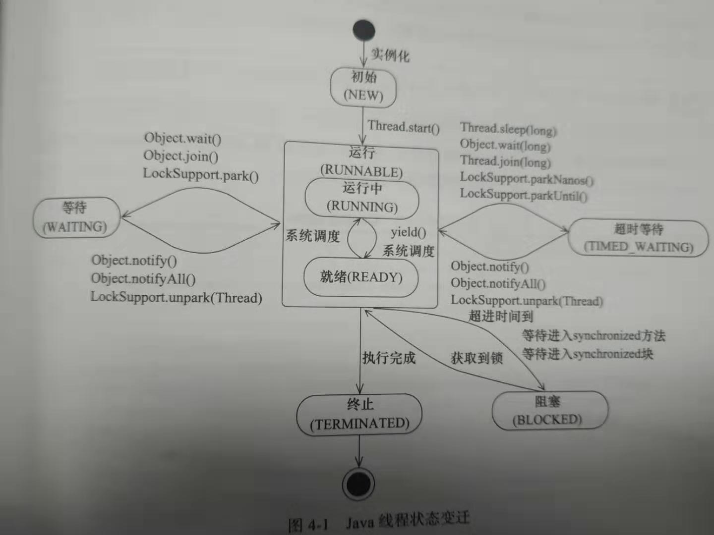

# 线程安全

线程安全一般指多线程之间的操作结果不会因为线程调度的顺序不同而发生改变


# 线程同步的实现方法

1. synchronized
2. wait,notify
3. lock
4. 信号量


# 线程的优先级

程序的优先级不能作为程序正确性的依赖，因为操作系统可以完全不理会JAVA线程对于优先级的设定


# 状态分类

| 状态名称     | 说明                                                         |
| ------------ | ------------------------------------------------------------ |
| NEW          | 初始状态，线程被构建，但是还没有调用start()方法              |
| RUNNABLE     | 运行状态，JAVA线程将操作系统中的就绪和运行两种状态笼统地称作“运行中” |
| BLOCKED      | 阻塞状态，表示线程阻塞于锁                                   |
| WAITING      | 等待状态，表示线程进入等待状态，进入该状态表示当前线程需要等待其他线程作出一些特定动作（通知或者中断） |
| TIME_WAITING | 超时等待状态，该状态不同于WAITING，它是可以在指定的时间自行返回的 |
| TEMINATED    | 终止状态，表示当前线程已经执行完毕                           |




# 构造线程

参数如下：

线程组

线程优先级

是否是守护线程

线程名字

线程ID

线程target(在原生run方法中，他只判断target是否为空，如果非空则运行，若你重写run方法就用不到了)


# 实现多线程的方式

1. 继承Thread类
2. 实现Runnable接口，并实现run方法
3. 实现Callable接口，并实现call方法


# Callable跟Runnable区别

1. Callable可以在任务结束后提供一个返回值，Runnable不行

2. Callable的call可以抛出异常，但是Runnable的run方法不行


# run方法和start方法的区别

run方法只是执行了run这个函数，start方法真正的异步的执行了RUN方法


# 启动线程

调用start()方法就可以启动这个线程。这个方法的含义，当前线程同步告知JAVA虚拟机，只要线程规划期空闲了，应该立即调用start()方法的线程


# 中断

与你自己设置的标志位区别在于：interrupt标志位即使是在阻塞的时候也能检测到


1. 线程的一个标识位属性，表示一个运行中的线程是否被其他线程进行了中断操作，其他线程通过调用该线程的interrupt()方法对其进行中断操作。
2. 线程本身可以使用isInterrupted()来判断是否被中断，也可以调用静态方法Thread.interrupted来让标志位复位。
3. 并且，如果该线程已经处于终结状态，即是该线程被中断过，在调用该线程对象的isInterrupted()时依旧会返回false
4. 如果抛出了InterrupedException，那么在抛出前，虚拟机会把中断标志位清除，再抛出,也就是说，这个时候调用isInterrupted()会返回false


备注：当一个线程处于阻塞状态的时候，调用了interruptException，那么就会发生interruptedexception

需要注意的是，你需要对这个异常进行捕获，然后进行一些操作（释放资源等），然后再将异常抛给上一级，以便上一级知道了你成功终止了线程


# 过时的方法（强烈不推荐使用）

suspend()暂停

resume()恢复

stop()停止

虽然能达到以上的效果，但是很有可能会造成资源不正确释放，死锁等问题


# 安全地终止线程

- 利用中断标志位终止线程
- 利用一个volatile型boolean变量来控制是否需要停止任务并终止该线程


# 等待/通知

## 方法

| 方法名称       | 描述                                                         |
| -------------- | ------------------------------------------------------------ |
| notify()       | 通知一个在对象上等待的线程，使其从wait()方法返回；而返回的前提是该线程获取到了对象的锁，也就是要等调用notify的线程释放锁；需注意的是调用notify不会让线程释放锁，只是起到将等待队列中的一个等待线程移到同步队列，被移到线程状态由WAITING变成BLOCKED |
| notifyAll()    | 通知所有等待在该对象上的线程                                 |
| wait()         | 调用该方法的线程会进入WAITING状态，只有等待另外线程的通知或者被中断才会返回，需要注意，调用wait()方法后，`会释放对象的锁`，并将当前线程放入等待队列 |
| wait(long)     | 超时等待一段时间，这里的参数是毫秒，也就是等待长达N毫秒，如果没有通知就超时返回 |
| wait(long,int) | 对于超时时间更细粒度的控制，可以达到纳秒（在等待了long毫秒时间后，继续等待int纳秒，然后再退出） |


## 经典范式

通知方（生产者）

1. 获得对象的锁
2. 改变条件
3. 通知所有等待在对象上的线程

```java
synchronized(对象){
	改变条件
	对象.notifyAll();
}
```


等待方（消费者）

1. 获取对象的锁
2. 如果条件不满足，则调用对象的wait()方法，`被通知后仍要检查条件`
3. 条件满足则执行对应的逻辑

```java
synchronized(对象){
    while(条件不满足){
        Object.wait();
    }
    逻辑处理
}
```


# Thread.join()的使用

如果一个线程A执行了thread.join()语句，那么他的含义是，当前线程A等待thread线程终止后才从thread.join()返回

也有超时等待的


源码

```java
// 加锁当前线程对象
public final synchronized void join(long millis){
  // 条件不足，继续等待
  while (isAlive()) {
      wait(0);
  }
  // 条件符合，方法返回
}
```


当线程终止时，会调用线程自身的**notifyAll**方法通知所有等待再该线程对象上的线程


# ThreadLocal的使用

## 定义

**ThreadLocal** 是一个线程内部的数据存储类，通过它可以在指定的线程中存储数据，数据存储以后，只有在指定线程中可以获取到存储的数据，对于其他线程来说则无法获取到数据。


## 原理

ThreadLocaL是一个泛型类，一个线程中有可以有多个ThreadLocal，一个线程只有一个ThreadLocalMap，要获取数据时，先通过当前线程名获取当前线程ThreadLocalMap，ThreadLocalMap保存的是键值对，键值为不同的ThreadLocal对象，值为相应ThreadLocal保存的数据，获取数据时以ThreadLocal为键值去ThreadLocalMap中获取对应的数据  


有set(),get()方法


好处是两个方法的调用不用在一个方法或一个类调用


# 守护线程

## 定义

大体跟普通线程一样，唯一的区别是当虚拟机里面不存在非守护线程，虚拟机会直接退出，而不是继续等待


## 作用

用做程序中后台调度以及支持性工作，比如JVM的垃圾回收线程


## 注意点

在构建守护线程时候，不能依靠finally块中的内容来确保执行关闭或者清理资源的逻辑


# sleep和wait区别

sleep和wait都是让线程暂停一段时间的方法

1. 原理不同

   ```
   sleep是Thread类的静态方法，会让线程暂停一段时间，把执行机会让给其他线程，等计时时间一到就自动苏醒
   
   wait是Object类的方法，用于线程通信，当线程暂停后，只有等其他线程唤醒他才能醒来
   ```

2. 对锁的处理机制不同

   ```
   sleep暂停的时候不会释放锁
   但是wait暂停的时候回释放锁
   ```

3. 使用区域不同

   ```
   sleep能在任何地方使用
   但是wait必须放在同步控制方法或者同步语句块
   ```


# sleep方法和yield方法区别

1. sleep方法给其他线程运行时不考虑线程优先级，但是yield只会给相同优先级或者更高优先级的线程运行机会
2. 线程执行sleep方法后会转入阻塞状态，而yield只是从执行状态变成可执行状态
3. sleep方法声明抛出InterruptedException,而yield没有任何影响

