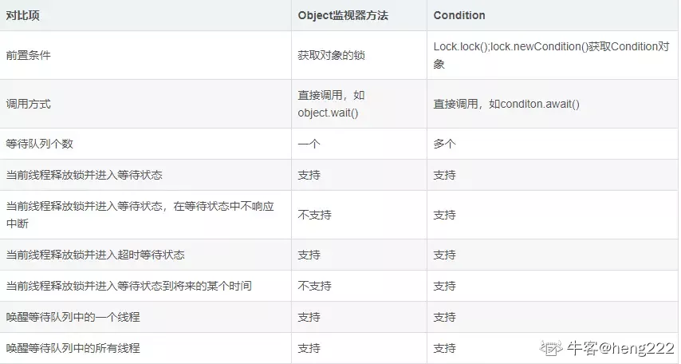

# 锁

- 锁是用来控制多个线程访问共享资源的方式，一般用来防止多个线程同时访问共享资源
- 但是有些锁允许多个线程并发访问共享资源，比如读写锁

# Lock

## 跟synchronized区别

少了synchronized的隐式获取锁和释放锁

拥有了锁获取与释放的可操作性、可中断的获取锁以及超时获取锁等多种synchronized关键字所不具备的同步特性

| 特性               | 描述                                                         |
| ------------------ | ------------------------------------------------------------ |
| 尝试非阻塞地获取锁 | 当前线程尝试获取锁，如果这一时刻锁没有被其他线程获取到，则成功获取并拥有锁 |
| 能被中断地获取锁   | 跟synchronized不同，获取到锁的线程能够响应中断，当获取到锁的线程被中断时，中断异常将会被抛出，同时锁会被释放 |
| 超时获取锁         | 在指定的截止时间之前获取锁，如果截止时间到了仍旧无法获取锁，则返回 |

## API

| 方法名称                                 | 描述                                                         |
| ---------------------------------------- | ------------------------------------------------------------ |
| void lock()                              | 获取锁，调用该方法当前线程将会获取锁，当锁获得后，从该方法返回 |
| void lockInterruptibly()                 | 可中断地获取锁，和lock()方法的不同之处在于该方法会响应中断，即在锁的获取中可以中断当前线程 |
| boolean tryLock()                        | 尝试非阻塞的获取锁，调用该方法后立刻放回，如果能够获取则返回true,否则返回false |
| boolean tryLock(long time,TimeUnit unit) | 超时的获取锁，当前线程在一下3种情况下回返回：①当前线程在超时时间内获得了锁，②当前线程在超时时间内被中断，③超时时间结束，返回false |
| void unlock()                            | 释放锁                                                       |
| Condition newCondition()                 | 获取等待通知组件，该组件和当前的锁绑定，当前线程只有获得了锁，才能调用该组件的wait()方法，而调用后，当前线程将释放锁 |

# 队列同步器

## 可重写的方法

| 方法名称                                    | 描述                                                         |
| ------------------------------------------- | ------------------------------------------------------------ |
| protected boolean tryAcquire(int arg)       | 独占式获取同步状态，实现该方法需要查询当前状态并且判断同步状态是否符合预期，然后再进行CAS设置同步状态 |
| protected boolean tryRelease(int arg)       | 独占式释放同步状态，等待获取同步状态的线程将会机会获取同步状态 |
| protected int tryAcquireShared(int arg)     | 共享式获取同步状态，返回大于等于0的值，表示获取成功，否则，获取失败 |
| protected boolean tryReleaseShared(int arg) | 共享式释放同步状态                                           |
| protected boolean isHeldExclusively()       | 当前同步器是否在独占模式下被线程占用，一般该方法表示是否被当前线程锁独占 |

## 同步队列

同步器依赖内部的同步队列（一个FIFO双向队列）来完成同步状态的管理，当前线程获取同步状态失败时候，同步器会将当前线程自己等待状态等信息构造成为一个结点并将其放入同步队列，同时会阻塞当前线程，当同步状态释放时候，会把首节点中的线程唤醒，使其再次尝试获取同步状态。

因为只有一个线程能够成功获取到同步状态，所以设置头结点的方法不需要使用CAS来保证

compareAndSetTail(Node expect,Node update)确保给点能够被安全添加

## 独占式同步状态

**通过同步器的acquire(int arg)方法可以获取同步状态**，该方法对中断不敏感，也就是说由于线程获取同步状态失败后进入同步队列中，后继对线程进行中断操作时，线程不会从同步队列移除

## 独占式同步状态获取

1. 首先调用自定义同步器实现的tryAcquire(int arg)方法，该方法保证线程安全的获取同步状态，
2. 如果同步状态获取失败，则构造同步结点并通过addWaiter(Node node)方法将该节点加入到同步队列的尾部，
3. 最后调用acqureQueued(Node node,int arg)方法，使得该节点以“死循环”的方式（自旋）获取同步状态。
4. 如果获取不到则阻塞结点中的线程，而被阻塞线程的唤醒主要依靠前驱结点的出队或者阻塞线程被中断来实现
5. 前驱结点为头结点且能够获取同步状态的判断条件和线程进入等待状态是获取同步状态的自旋过程

## 为什么只有在前驱结点是头结点才能尝试获取同步状态

1. 头结点是成功获取同步状态的节点，而头结点的线程释放了同步状态之后，将会唤醒其后继结点，后继结点的线程被唤醒后需要检查自己的前驱结点是否是头结点
2. 维护同步队列FIFO原则

## 独占式同步状态释放

释放同步状态后，唤醒其后继结点，让后继结点重新尝试获取同步状态

在获取同步状态时候，同步器会维护一个同步队列，获取状态失败的线程都会被加入到队列中并且在队列中进行自旋；

移出队列的条件是前驱结点为头结点且成功获取了同步状态，如果获得了，那么就应该尝试获得锁

在释放同步状态时候，同步器调用tryRelease方法释放同步状态，然后唤醒头结点的后继结点。

## 共享式和独占式释放锁主要区别

- 共享式获取与独占式获取最主要的**区别在于同一时刻能否有多个线程同时获取到同步状态**
- **获取共享式同步状态**：通过调用**同步器的acquireShared(int arg)方法可以共享式地获取同步状态**：

## 独占式超时获取同步状态

通过调用同步器的doAcquireNanos(int arg,long nanosTimeout)方法可以超时获取同步状态，即在指定的时间段获取同步状态，如果获取到同步状态则返回true,否则返回false

获取同步状态基本与独占式相同，最大的不同是获取失败的时候回判断是否超时，

如果没有超时，就重新计算超时时间间隔，然后让当前线程等待超时时间间隔纳秒，

并且，如果超时时间间隔小于1000纳秒，那不会让该线程进行超时等待，而是进入快速的自旋过程，

原因在于，非常短的超时等待无法做到十分精确，如果这个时候再进行超时等待，反而会让nanaosTimeout的超时从整体上表现得反而不精确。

所以，在超时非常短的场景下，同步器会进入无条件的快速自旋

# 重入锁ReentrantLock

支持重进入的锁，表示该锁支持一个线程对资源的重复加锁，以及获取锁时的公平和非公平性选择

公平性锁：如果FIFO，那么这个锁是公平的，同时也代表着等待时间最长的锁最优先获取锁

## 实现重进入

重进入是指任意线程在获取到锁之后能够再次获取该锁而不会被锁所阻塞，这需要解决两个问题（通过STATE计数解决）

1. 线程再次获取锁
2. 锁的最终释放

## 公平锁实现

加入同步队列中当前节点是否有前驱结点的判断，如果该方法返回true,则表示有线程比当前线程更早地请求获取锁，因此需要等待前驱线程获取并释放锁之后才能继续获取锁

## 非公平锁的饥饿现象

### 原因

当一个线程请求锁时候，只要获取了同步状态即可以获取锁，刚释放锁的线程再获取同步状态的几率会非常大，使得其他线程只能在同步队列中等待

### 优势

非公平锁线程切换比较少，开销也就越少，保证了更大的吞吐量

# 读写锁ReentrantReadWriteLock

## 传统的是如何实现

使用JAVA的等待通知机制，当写操作开始时候，所有晚于写操作的读操作均会进入等待状态，只有写操作完成并且进行通知之后，所有等待的读操作才能继续执行（写操作之间依靠synchronized同步），目的是让读操作能够读取到正确的数据，不会出现脏读

## 实现

在读操作时获取读锁，写操作时候获取写锁即可。当写锁被获取的时候，后续（非当前写操作线程）的写读操作都会被阻塞，写锁释放之后，所有操作继续执行。此外，当读锁存在的时候就无法获取写锁（原因：正在运行的读线程无法感知到当前写线程的操作）

## 优点

性能比排它锁好，因为大多数场景读是多余写的，在读多于写的情况下，读写锁能够提供比排它锁更好的并发性和吞吐量

| 特性       | 说明                                                         |
| ---------- | ------------------------------------------------------------ |
| 公平性选择 | 支持非公平和公平的锁获取方式，吞吐量还是非公平优于公平       |
| 重进入     | 该锁支持重进入，以读写线程为例：读线程在获取了读锁之后，能够再次获取读锁。而写线程在获取了写锁之后能够再次获取写锁，同时也可以获取读锁 |
| 锁降级     | 遵循获取写锁、获取读锁再释放写锁的次序，写锁能够降级成为读锁 |

## 读写状态的设计实现

按位切割使用变量

高十六位表示读，通过右移16位，将低16位去掉

低十六位表示写，通过位于0x0000FFFF将高十六位抹去

推论：当S不等于0，,且写状态等于0，则读状态大于0，即是读锁已被获取

## 写锁的获取与释放

写锁支持重进入的排它锁。如果当前线程已经获取了写锁，则增加写状态，如果当线程在获取写锁时候，如果读锁已经被获取了或者该线程不是已经获取写锁的线程，则当前线程进入等待状态

## 读锁的获取与释放

读锁是一个支持重进入的共享锁，它能够被多个线程同时获取，在没有其他写线程访问时候，读锁总会被成功地获取。如果写锁被其他线程获取，则进入等待状态

读锁的每次释放均减少读状态，减少的值是1<<16	(1左移16位)

## 锁降级

锁降级值得是写锁降级成为读锁。

如果当前线程拥有写锁，然后将其释放，最后再获取读锁，这种分段完成的过程不能叫做锁降级。

锁降级是指把持住写锁，再获取读锁，然后再释放写锁的过程

## 锁降级过程中读锁获取的必要性

为了保证数据的可见性，如果当前线程不获取读锁而是直接释放写锁，假如此时，另一个线程T获取了写锁并且修改了数据，那么当前线程无法感知线程T的数据更新。

## 为什么不能锁升级

保证数据可见性，如果读锁已被多个线程获取，其中任意线程成功获取了写锁并且修改了数据，更新对其他获取获取到读锁的线程是不可见的。

# LockSupport工具

## 作用

阻塞或唤醒一个线程

## 方法

park()    parkNanos(long nanos)		parkUntil(long deadline) 	unpark(Thread thread)

# Condition

## 定义

​	**任意一个Java对象都拥有一组监视器方法（定义在java.lang.Object上），主要包括：wait（）、wait（long timeout）、notify()、notifyAll（）,这些方法和synchronized关键字结合使用，可以实现等待/通知模式**。**Condition接口也提供了类似Object的监视器方法，与Lock接口配合使用实现等待/通知模式**  

## 使用

​	**获取一个Condition必须要通过Lock的newCondition()方法**。**该方法定义在接口Lock下面，返回的结果是绑定到此 Lock 实例的新 Condition 实例**

​	Condition为一个接口，**其下仅有一个实现类ConditionObject**，**由于Condition的操作需要获取相关的锁，而AQS则是同步锁的实现基础，所以ConditionObject则定义为AQS的内部类**

​	当调用await()方法后，当前线程会释放锁并在此等待，而其他线程调用Condition对象的signal()方法，通知当前线程后，当前线程才从await()方法返回，并且在返回前一句获取了锁

## Object的监视器方法与Condition接口的对比

## 等待队列

### 定义

单向链表，有首尾结点的引用，结点的构造跟同步队列一样

结点更新的过程没有使用CAS保证，原因在于调用await()方法的线程必定是获取了锁的线程，也就是说该过程是由锁来保证线程安全的。

### 等待

调用该方法的线程成功获取了锁的线程，将当前线程构造成结点并且加入等待队列，然后释放同步状态，唤醒同步队列中的后继结点，然后当前线程会进入等待状态

### 通知

调用Condition的signal()方法，会将首节点移动到同步队列中，然后当前线程再使用localsupport唤醒该节点的线程，被唤醒后的线程从是否在同步队列中的循环退出，然后调用同步器的获取同步状态进行竞争

调用方法的前置条件是当前线程必须获取了锁

