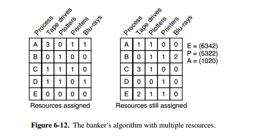

# 并发与并行

并发是指宏观上在一段时间内能同时运行多个程序，而并行则指同一时刻能运行多个指令。

并行需要硬件支持，如多流水线、多核处理器或者分布式计算系统。

操作系统通过引入进程和线程，使得程序能够并发运行。

# 同步与异步

关注的是请求与响应的通讯机制，描述的是被调用方。发出请求后，该请求是否等待响应结果再返回

`同步`: 没有得到结果前不会返回，返回即得到请求的结果

`异步`：得到发出请求后就直接返回，也即是可能不会立即得到请求结果，服务得到结果后再通过通知或回调函数等方法通知调用者。

# 阻塞与非阻塞

关注的是请求在等待结果时的状态，描述的是调用方

阻塞就是在等待结果的时候，当前线程会被挂起，在得到结果之后返回；

非阻塞则是没有得到结果之也不会阻塞当前线程。

# 操作系统基本功能

## 1. 进程管理

进程控制、进程同步、进程通信、死锁处理、处理机调度等。

## 2. 内存管理

内存分配、地址映射、内存保护与共享、虚拟内存等。

## 3. 文件管理

文件存储空间的管理、目录管理、文件读写管理和保护等。

## 4. 设备管理

完成用户的 I/O 请求，方便用户使用各种设备，并提高设备的利用率。

主要包括缓冲管理、设备分配、设备处理、虛拟设备等。

# 用户态(r3)与内核态(r0)

## 定义

防止用户进程访问对操作系统的稳定运行造成破坏。对一些资源的访问进行了等级划分。**内核态和用户态是操作系统的两种运行级别，内核态权限高，用户态权限低。**

## 区别

- 处于用户态执行时，进程所能访问的内存空间和对象受到限制，其所处于占有的处理器是可被抢占的
- 处于内核态执行时，则能访问所有的内存空间和对象，且所占有的处理器是不允许被抢占的。

## 切换

​	进程大部分时间是运行在用户态下的，在其需要操作系统帮助完成一些用户态自己没有特权和能力完成的操作时就会切换到内核态。

​	切换到内核的方式有：系统调用、发生异常、外围设备的中断

# 进程

## 定义

进程是资源分配的基本单位。

进程控制块 (Process Control Block, PCB) 描述进程的基本信息和运行状态，所谓的创建进程和撤销进程，都是指对 PCB 的操作。

## 进程同步方法

### 1.临界区

对临界资源进行访问的那段代码称为临界区。

为了互斥访问临界资源，每个进程在进入临界区之前，需要先进行检查。

### 2.同步与互斥

- 同步：多个进程因为合作产生的直接制约关系，使得进程有一定的先后执行关系。
- 互斥：多个进程在同一时刻只有一个进程能进入临界区。

### 3.信号量

信号量（Semaphore）是一个整型变量，可以对其执行 down 和 up 操作，也就是常见的 P 和 V 操作。

- **down** : 如果信号量大于 0 ，执行 -1 操作；如果信号量等于 0，进程睡眠，等待信号量大于 0；
- **up** ：对信号量执行 +1 操作，唤醒睡眠的进程让其完成 down 操作。

down 和 up 操作需要被设计成原语，不可分割，通常的做法是在执行这些操作的时候屏蔽中断。

如果信号量的取值只能为 0 或者 1，那么就成为了 **互斥量（Mutex）** ，0 表示临界区已经加锁，1 表示临界区解锁。

### 4.管程

在一个时刻只能有一个进程使用管程。进程在无法继续执行的时候不能一直占用管程，否则其它进程永远不能使用管程。管程引入了 **条件变量** 以及相关的操作：**wait()** 和 **signal()** 来实现同步操作。

## 经典同步问题

### 1.生产者消费者

问题描述：使用一个缓冲区来保存物品，只有缓冲区没有满，生产者才可以放入物品；只有缓冲区不为空，消费者才可以拿走物品。

解决方法：信号量，管程

### 2.哲学家进餐问题

​	五个哲学家围着一张圆桌，每个哲学家面前放着食物。哲学家的生活有两种交替活动：吃饭以及思考。当一个哲学家吃饭时，需要先拿起自己左右两边的两根筷子，并且一次只能拿起一根筷子。

为了防止死锁的发生，可以设置两个条件：

- 必须同时拿起左右两根筷子；
- 只有在两个邻居都没有进餐的情况下才允许进餐。

### 3.读者-写者问题

​	允许多个进程同时对数据进行读操作，但是不允许读和写以及写和写操作同时发生。

​	一个整型变量 count 记录在对数据进行读操作的进程数量，一个互斥量 count_mutex 用于对 count 加锁，一个互斥量 data_mutex 用于对读写的数据加锁。

## 进程通信与进程同步区别

- 进程同步：控制多个进程按一定顺序执行；
- 进程通信：进程间传输信息。

## 进程通信的方法

1. 管道（pipe）

   无名管道, 半双工的（即数据只能在一个方向上流动），具有固定的读端和写端。只能用于父子进程和兄弟进程。

   FIFO，也称为命名管道，是一种文件类型。FIFO的通信方式类似于在进程中使用文件来传输数据，只不过FIFO类型文件同时具有管道的特性。在数据读出时，FIFO管道中同时清除数据，并且“先进先出”。可用于任何进程。

2. 消息队列

   **消息队列是由消息组成的链表，存放在内核中并由消息队列标识符标识**。

   优势是对每个消息指定特定的消息类型，接收的时候不需要按照队列次序，而是可以根据自定义条件接收特定类型的消息。

   

   相比于 FIFO，消息队列具有以下优点：

   - 消息队列可以独立于读写进程存在，从而避免了 FIFO 中同步管道的打开和关闭时可能产生的困难；

   - 避免了 FIFO 的同步阻塞问题，不需要进程自己提供同步方法；

   - 读进程可以根据消息类型有选择地接收消息，而不像 FIFO 那样只能默认地接收。

     

3. 共享内存

   

   指两个或多个进程共享一个给定的存储区。共享内存是最快的一种 IPC，因为进程是直接对内存进行存取。因

   为多个进程可以同时操作，所以需要进行同步。信号量+共享内存通常结合在一起使用，信号量用来同步对共享内存的访问。

4. 套接字

5. 信号量

   **它是一个计数器。信号量用于实现进程间的互斥与同步，而不是用于存储进程间通信数据。**

## 进程调度方法

1.先来先服务调度算法

2.短作业优先调度算法

3.最短剩余时间优先

4.时间片轮转法

5.高优先权优先调度算法

6.多级反馈队列调度算法

## 进程空间

​	  内核态内存空间、用户态的堆栈（一般8M，从高地址向低地址增长）、数据段、进程代码段

​	线程共享的有：进程代码段、进程共有数据、文件描述符、信号处理器、进程当前目录、进程用户ID、进程组ID.

​	线程私有的：线程ID、寄存器的值、线程的栈、线程优先级、错误返回码、线程信号屏蔽码。

## 进程状态的切换

- 就绪状态（ready）：等待被调度
- 运行状态（running）
- 阻塞状态（waiting）：等待资源

应该注意以下内容：

- 只有就绪态和运行态可以相互转换，其它的都是单向转换。就绪状态的进程通过调度算法从而获得 CPU 时间，转为运行状态；而运行状态的进程，在分配给它的 CPU 时间片用完之后就会转为就绪状态，等待下一次调度。
- 阻塞状态是缺少需要的资源从而由运行状态转换而来，但是该资源不包括 CPU 时间，缺少 CPU 时间会从运行态转换为就绪态。

# 死锁

## 1.死锁概念

无限期的阻塞、相互等待的一种状态

## 2.死锁的四个必要条件

1.互斥：每个资源要么已经分配给了一个进程，要么就是可用的。

2.占有并等待：已经得到了某个资源的进程可以再请求新的资源。

3.非抢占：已经分配给一个进程的资源不能强制性地被抢占，它只能被占有它的进程显式地释放。

4.循环等待：有两个或者两个以上的进程组成一条环路，该环路中的每个进程都在等待下一个进程所占有的资源。

## 3.死锁的处理方法

- 鸵鸟策略

  当发生死锁时不会对用户造成多大影响，或发生死锁的概率很低，可以采用鸵鸟策略。

- 死锁检测与死锁恢复

  不试图阻止死锁，而是当检测到死锁发生时，采取措施进行恢复。

  1.每种类型一个资源的死锁检测

  2.每种类型多个资源的死锁检测

  3.死锁恢复

  - 利用抢占恢复
  - 利用回滚恢复
  - 通过杀死进程恢复

- 死锁预防

  在程序运行之前预防发生死锁。

  1. 破坏互斥条件

  2. 破坏占有和等待条件
  3. 破坏不可抢占条件
  4. 破坏环路等待

- 死锁避免

  在程序运行时避免发生死锁。经典的有银行家算法。

  

  银行家算法：判断对请求的满足是否会进入不安全状态，如果是，就拒绝请求；否则予以分配。

  

  上图中有五个进程，四个资源。左边的图表示已经分配的资源，右边的图表示还需要分配的资源。最右边的 E、P 以及 A 分别表示：总资源、已分配资源以及可用资源，注意这三个为向量，而不是具体数值，例如 A=(1020)，表示 4 个资源分别还剩下 1/0/2/0。

  检查一个状态是否安全的算法如下：

  - 查找右边的矩阵是否存在一行小于等于向量  A。如果不存在这样的行，那么系统将会发生死锁，状态是不安全的。
  - 假若找到这样一行，将该进程标记为终止，并将其已分配资源加到 A 中。
  - 重复以上两步，直到所有进程都标记为终止，则状态时安全的。

  如果一个状态不是安全的，需要拒绝进入这个状态。

# 线程

## 定义

线程是独立调度的基本单位

## 优点

1. 使用多线程可以减少程序的响应时间
2. 与进程相比，线程创建切换开销更小
3. 多CPU和多核计算机本就具有执行多线程的能力
4. 简化程序结果

## 线程与进程区别

1. **从定义上：**进程是资源分配最小单位，线程是程序执行的最小单位；

2. **从地址空间上：**进程有自己独立的地址空间，每启动一个进程，系统都会为其分配地址空间，建立数据表来维护代码段、堆栈段和数据段，线程没有独立的地址空间，它使用相同的地址空间共享数据；

3. **从资源占用和开销上：**一个线程的创建、切换、占用的资源和开销都要比进程少

4. **从通信上：**线程之间通信更方便，同一个进程下，线程共享全局变量，静态变量等数据，进程之间的通信需要以通信的方式（IPC）进行；（但多线程程序处理好同步与互斥是个难点）

5. **从安全上：**多进程程序更安全，生命力更强，一个进程死掉不会对另一个进程造成影响（源于有独立的地址空间），多线程程序更不易维护，一个线程死掉，整个进程就死掉了（因为共享地址空间）；

6. **从效率上：**进程对资源保护要求高，开销大，效率相对较低，线程资源保护要求不高，但开销小，效率高，可频繁切换；

   

## 通信方式

1. 信号量

2. 信号

3. 消息队列

4. 共享内存

5. 套接字

6. 管道

   

## 线程上下文切换开销

分为直接开销和间接开销

直接开销有：

1. 操作系统保存恢复上下文(CPU寄存器值，程序计数器值等)所需的开销
2. 线程调度器调度线程的开销

间接开销：

1. 处理器**高速缓存重新加载**的开销

2. 上下文切换可能导致整个一级高速缓存中的内容被冲刷，即被写入到下一级高速缓存或主存

   

# 协程

## 定义

1. 协程是一种用户态的轻量级线程，协程的调度完全由用户控制。
2. 协程拥有自己的寄存器上下文和栈。协程调度切换时，将寄存器上下文和栈保存到其他地方。
3. 在切回来的时候，恢复先前保存的寄存器上下文和栈，直接操作栈则基本没有内核切换的开销，可以不加锁的访问全局变量，所以上下文的切换非常快。
4. 进程线程都是同步机制，而协程则是异步。协程不需要多线程的锁机制。

## 协程与线程区别

1. 地址空间:线程是进程内的一个执行单元，进程内至少有一个线程，它们共享进程的地址空间，而进程有自己独立的地址空间
2. 资源拥有:进程是资源分配和拥有的单位,同一个进程内的线程共享进程的资源
3. 线程是处理器调度的基本单位,但进程不是
4. 二者均可并发执行
5. 每个独立的线程有一个程序运行的入口、顺序执行序列和程序的出口，但是线程不能够独立执行，必须依存在应用程序中，由应用程序提供多个线程执行控制

# 虚拟内存

## 定义

电脑中所运行的程序均需经过内存执行，若执行的程序占用的内存很大很多，则会导致内存消耗殆尽，为解决该问题，WINDOWS运用了虚拟内存技术，即拿出一部分硬盘空间来充当内存使用，这部分空间即称为虚拟内存。

 

## 优点

可以弥补物理内存大小的不足；一定程度的提高反映速度；减少对物理内存的读取从而保护内存延长内存使用寿命；

## 缺点

占用一定的物理硬盘空间；加大了对硬盘的读写；设置不得当会影响整机稳定性与速度

# 分页和分段

## 分页

用户程序的地址空间被划分成若干固定大小的区域，称为“页”

优点：没有外碎片，每个内碎片不超过页的大小

缺点：程序全部装入内存，要求有相应的硬件支持，如地址变换机构缺页中断的产生和选择淘汰页面等都要求有相应的硬件支持。增加了机器成本和系统开销

## 页面置换算法

先进先出算法

最佳置优算法

最近最少使用算法

最少使用次数算法

## 分段

 页面是主存物理空间中划分出来的等长的固定区域

优点：可以分别编写和编译，可以针对不同类型的段采取不同的保护，可以按段为单位来进行共享，包括通过动态链接进行代码共享。

缺点：会产生碎片。

存储分配时，以段为单位，段内地址连续，段间不连续。虚拟地址由段号和段内地址组成，虚拟地址到实存地址的变换通过段表来实现。 分页对程序猿而言是不可见的。而分段通常对程序猿而言是可见的，因而分段为组织程序和数据提供了方便。

## 段页式

优点：段页式管理是段式管理和页式管理相结合而成，具有两者的优点。

缺点：由于管理软件的增加，复杂性和开销也增加。另外需要的硬件以及占用的内存也有所增加，使得执行速度下降。

## 虚拟内存换页的过程

在进程开始运行之前，不是全部装入页面，而是装入一个或者零个页面，之后根据进程运行的需要，动态装入其他页面；当内存已满，而又需要装入新的页面时，则根据某种算法淘汰某个页面，以便装入新的页面。

 

## 在使用虚拟页式存储管理时需要在页表中增加一些内容

页号、驻留位（中断位）、内存块号、外存地址、访问号、修改位
驻留位：表示该页在外存还是内存；
访问位：表示该页在内存期间是否被访问过，又称R位；
修改位：表示该页在内存中是否被修改过，又称M位；

##  换页算法里面，FIFO有什么缺点？怎么改进？

​	先进先出实现简单，但并没有考虑局部性原理，最近访问过的数据不久之后很可能会再次被访问。性能可能会很差。还会发生Belady异常现象， 使用FIFO算法时，四个页框时缺页次数比三个页框时多。这种奇怪的情况称为Belady异常现象。

​	改进方法：用第二次机会算法

即给每个页面增加一个R位，表示最近访问过，每次先从链表头开始查找，如果R置1位，清除R位并且把该页面节点放到链表结尾；如果R是0，那么就是又老又没用到，替换掉。

## 区别

1.分页是信息的物理单位，分页式存储是系统管理上的需要；分段是信息的逻辑单位，为了更好满足用户需要。

2.页的大小固定且由系统决定，段的大小不固定，决定于用户编写的程序

3.分页用户程序地址空间是一维的，分段是二维的

# 磁盘管理

## 磁盘结构

- 盘面（Platter）：一个磁盘有多个盘面；
- 磁道（Track）：盘面上的圆形带状区域，一个盘面可以有多个磁道；
- 扇区（Track Sector）：磁道上的一个弧段，一个磁道可以有多个扇区，它是最小的物理储存单位，目前主要有 512 bytes 与 4 K 两种大小；
- 磁头（Head）：与盘面非常接近，能够将盘面上的磁场转换为电信号（读），或者将电信号转换为盘面的磁场（写）；
- 制动手臂（Actuator arm）：用于在磁道之间移动磁头；
- 主轴（Spindle）：使整个盘面转动。

# 磁盘调度算法

读写一个磁盘块的时间的影响因素有：

- 旋转时间（主轴转动盘面，使得磁头移动到适当的扇区上）
- 寻道时间（制动手臂移动，使得磁头移动到适当的磁道上）
- 实际的数据传输时间

其中，寻道时间最长，因此磁盘调度的主要目标是使磁盘的平均寻道时间最短。

## 1. 先来先服务(FSFS)

按照磁盘请求的顺序进行调度。

优点是公平和简单。缺点也很明显，因为未对寻道做任何优化，使平均寻道时间可能较长。

## 2. 最短寻道时间优先（SSTF）

优先调度与当前磁头所在磁道距离最近的磁道。

虽然平均寻道时间比较低，但是不够公平。如果新到达的磁道请求总是比一个在等待的磁道请求近，那么在等待的磁道请求会一直等待下去，也就是出现饥饿现象。具体来说，两端的磁道请求更容易出现饥饿现象。

## 3. 电梯算法(SCAN)

电梯总是保持一个方向运行，直到该方向没有请求为止，然后改变运行方向。

电梯算法（扫描算法）和电梯的运行过程类似，总是按一个方向来进行磁盘调度，直到该方向上没有未完成的磁盘请求，然后改变方向。

因为考虑了移动方向，因此所有的磁盘请求都会被满足，解决了 SSTF 的饥饿问题。

# 链接

## 编译系统

- 预处理阶段：处理以 # 开头的预处理命令；
- 编译阶段：翻译成汇编文件；
- 汇编阶段：将汇编文件翻译成可重定位目标文件；
- 链接阶段：将可重定位目标文件和 printf.o 等单独预编译好的目标文件进行合并，得到最终的可执行目标文件。

## 静态链接

静态链接器以一组可重定位目标文件为输入，生成一个完全链接的可执行目标文件作为输出。链接器主要完成以下两个任务：

- 符号解析：每个符号对应于一个函数、一个全局变量或一个静态变量，符号解析的目的是将每个符号引用与一个符号定义关联起来。
- 重定位：链接器通过把每个符号定义与一个内存位置关联起来，然后修改所有对这些符号的引用，使得它们指向这个内存位置。

## 目标文件

- 可执行目标文件：可以直接在内存中执行；
- 可重定位目标文件：可与其它可重定位目标文件在链接阶段合并，创建一个可执行目标文件；
- 共享目标文件：这是一种特殊的可重定位目标文件，可以在运行时被动态加载进内存并链接；

## 动态链接

静态库有以下两个问题：

- 当静态库更新时那么整个程序都要重新进行链接；
- 对于 printf 这种标准函数库，如果每个程序都要有代码，这会极大浪费资源。

共享库是为了解决静态库的这两个问题而设计的，在 Linux 系统中通常用 .so 后缀来表示，Windows 系统上它们被称为 DLL。它具有以下特点：

- 在给定的文件系统中一个库只有一个文件，所有引用该库的可执行目标文件都共享这个文件，它不会被复制到引用它的可执行文件中；
- 在内存中，一个共享库的 .text 节（已编译程序的机器代码）的一个副本可以被不同的正在运行的进程共享。

