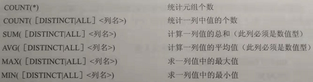
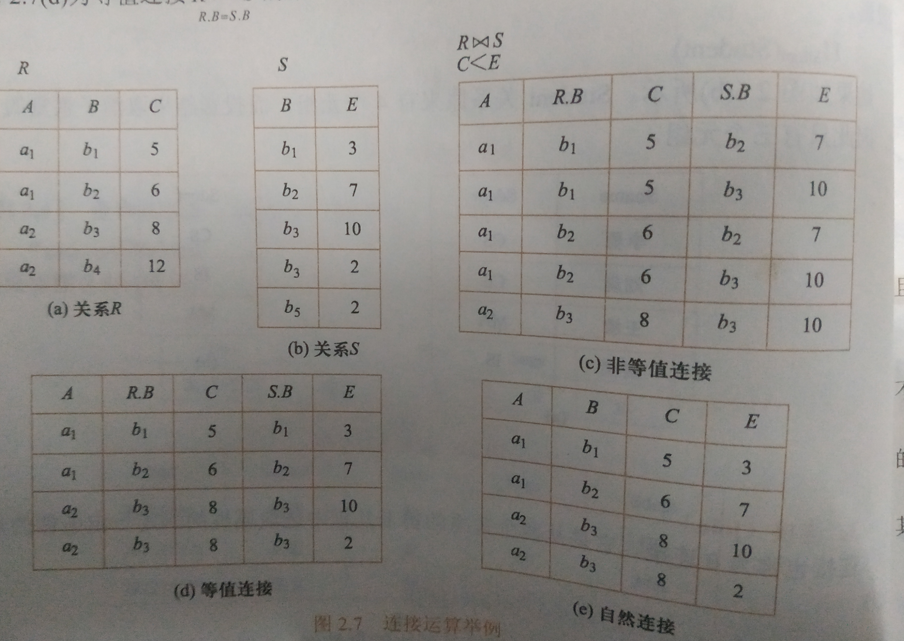
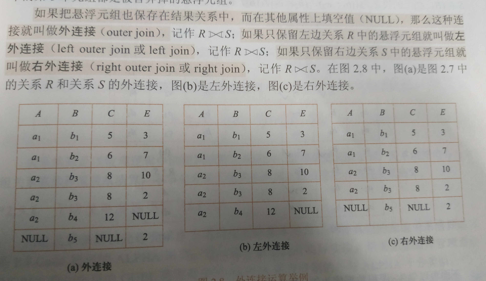

|  java类型  |      mysql类型      |
| :--------: | :-----------------: |
|    byte    |       tinyint       |
|   short    |      smallint       |
|    int     |         int         |
|    long    |       bigint        |
|   float    |        float        |
|   double   |       double        |
|  boolean   |       tinyint       |
|    char    |    vachar , char    |
|   String   | vachar , char ,TEXT |
| bigDECIMAL |       DECIMAL       |
|    Date    |        Date         |
|    TIME    |        TIME         |
| TIMESTAMP  |      TIMESTAMP      |


# 授予权限

```sql
grant xx
to xx;
```


# 收回权限

```sql
revoke xx
from xx
```


# 创建表

```sql
create table student(
    id int not null auto_increment;//自增
    name varchar(20) not null,//变长
    dept_id int not null,
    foreign key(dept_id) references dept(dept_id)//外键
);
```


# 修改表

添加列

```sql
alter table test
add col char(20);
```

删除列

```sql
ALTER TABLE test
DROP COLUMN col;
```

删除表

```sql
DROP TABLE test;
```


# 插入

```sql
INSERT INTO mytable(col1, col2)
VALUES(val1, val2);
```

插入检索出来的数据

```sql
INSERT INTO mytable1(col1, col2)
SELECT col1, col2
FROM mytable2;
```

将一个表的内容插入到一个新表

```sql
CREATE TABLE newtable AS
SELECT * FROM mytable;
```


# 删除

```sql
DELETE FROM mytable
WHERE id = 1;
```

**TRUNCATE TABLE**  可以清空表，也就是删除所有行。

```sql
TRUNCATE TABLE mytable;
```

使用更新和删除操作时一定要用 WHERE 子句，不然会把整张表的数据都破坏。可以先用 SELECT 语句进行测试，防止错误删除。


# 查询

## 别名

```sql
select Sname name 
from student;
```


## between,and

```sql
SELECT DISTINCT age
FROM person
where age between 20 and 25;
```


## 属于集合

```sql
SELECT dept_name
FROM dept
where dept_name in('software_engineering','computer_science') ;
```


## 字符串匹配

%表示任意长度

_表示一个字符

```sql
select sname
from student
where sname like '_VPN%';
```


**值得注意的是，如何是查询的字符串本身含有%，_,那么需要用escape**

```sql
SELECT dept_name
FROM dept
where dept_name like 'software\_engineering' escape'\ ;
```


## DISTINCT

相同值只会出现一次。它作用于所有列，也就是说所有列的值都相同才算相同。

```sql
SELECT DISTINCT col1, col2
FROM mytable;
```


## order by

升序用ASC,降序用desc，默认为升序

如，查询所有学生情况，系号升序排列，同一系的学生按年龄降序排列

```sql
select *
from student
order by dept,age desc;
```


## LIMIT

限制返回的行数。可以有两个参数，第一个参数为起始行，从 0 开始；第二个参数为返回的总行数。(**索引从0开始**)


返回第 3 \~ 5 行：

```sql
SELECT *
FROM mytable
LIMIT 2, 3;
```


## 聚集函数

group by子句，分组

概念：将查询结果按某一列或者多列的值分组，值相等的为一组



**NOTE:聚集函数不能在WHERE子句中使用**


如，查询平均成绩大于等于90分的学生学号和平均成绩

```sql
select id,avg(grade)
from student
group by sno
having avg(grade)>=90;
```


# 修改

修改某一元组的值

```sql
update student
set sage=22
where sno='4545'
```


带子查询的修改语句

```sql
update student
set grade=0
where sno  in(
	select sno
	from student
	where sdept='计算机系')
```


# 连接

## 内连接/等值连接

```sql
select student.*，sc.*
from student,sc
where student.sno=sc.sno;
```

## 自连接

```sql
select first.cno,second.cpno
from course first,course second
where first.cpno=second.cno;
```


查出跟JIM一个部门的人的名字

```sql
SELECT name
FROM employee
WHERE department = (
      SELECT department
      FROM employee
      WHERE name = "Jim");
```

## 自然连接

自然连接是把同名列通过等值测试连接起来的，同名列可以有多个。

内连接和自然连接的区别：内连接提供连接的列，而自然连接自动连接所有同名列。

```sql
select a.value,b.value
from table as A natural join tableb as B;
```


## 外连接






外连接保留了没有关联的那些行。分为左外连接，右外连接以及全外连接，左外连接就是保留左表没有关联的行。

检索所有顾客的订单信息，包括还没有订单信息的顾客。

```sql
SELECT Customers.cust_id, Orders.order_num
FROM Customers LEFT OUTER JOIN Orders
ON Customers.cust_id = Orders.cust_id;
```


customers 表：

| cust_id | cust_name |
| :-----: | :-------: |
|    1    |     a     |
|    2    |     b     |
|    3    |     c     |

orders 表：

| order_id | cust_id |
| :------: | :-----: |
|    1     |    1    |
|    2     |    1    |
|    3     |    3    |
|    4     |    3    |

结果：

| cust_id | cust_name | order_id |
| :-----: | :-------: | :------: |
|    1    |     a     |    1     |
|    1    |     a     |    2     |
|    3    |     c     |    3     |
|    3    |     c     |    4     |
|    2    |     b     |   Null   |


## ANY或ALL谓语的子查询

```sql
select sno,cno
from sc x
where grade>=(select avg(grade)
             from sc y
             where y.sno=x.sno);
```


# 组合查询

使用  **UNION**  来组合两个查询，如果第一个查询返回 M 行，第二个查询返回 N 行，那么组合查询的结果一般为 M+N 行。

每个查询必须包含相同的列、表达式和聚集函数。

默认会去除相同行，如果需要保留相同行，使用 UNION ALL。

只能包含一个 ORDER BY 子句，并且必须位于语句的最后。

```sql
SELECT col
FROM mytable
WHERE col = 1
UNION
SELECT col
FROM mytable
WHERE col =2;
```


## Exists子查询

带有Exists位于的子查询不返回任何数据，只产生逻辑值TRUE或者FALSE

例如：查询所有选修了1号课程的学生姓名

```sql
select name
from student
where exists
      (select *
      from sc
      where sc.sno=student.sno and cno='1');
```


# 视图

## 定义

视图是虚拟的表，本身不包含数据，只是一个定义，当然也不能用索引。


## 好处

1. 简化数据查询语句
2. 可以使用户能从多角度看待同一数据
3. 提高数据的安全性
4. 提高了一定程度的逻辑独立


## 缺点

主要是性能差（比直接操作表要慢）

```sql
create view myview as
SELECT Concat(col1, col2) AS concat_col, col3*col4 AS compute_col
FROM mytable
WHERE col5 = val;
```


# 存储过程

## 定义

存储过程是为了完成特定功能的SQL语句集，经编译创建并保存在数据库中，用户可通过指定存储过程的名字并给定参数(需要时)来调用执行。


## 优点

1.由于可以用流程控制语句编写存储过程，有很强的灵活性

2.存储过程可以使没有权限的用户在控制之下的用户简介地存取数据库，也保证了数据的安全


## 与函数的区别

1.存储过程一般是作为一个独立的部分，函数可以作为一个查询语句的一个部分来调用

2.存储过程实现的功能较复杂，而函数实现的功能性较强


# 触发器

## 定义

当数据库有特殊的操作，操作触发了事件，自动完成SQL语句


## 分类

DML触发器

​	当数据库服务器发生数据操作语言事件时执行的存储过程，Afte和Instead o这两个触发器。After触发器被激活触发是在记录改变以后进行的一种触发器。Instead of触发器是在记录变更之前，去执行触发器本身所定义的操作，而不是原来SQLL语句里的操作

DLL触发器

​	响应数据定义语言事件时执行的存储过程


## 作用

1. 增加安全性
2. 利用触发器记录进行的修改以及相关信息，跟踪用户对数据库的操作
3. 维护那些通过创建表时候的生命约束不可能实现的复杂的完整性约束以及对数据库中特定事件进行监控响应
4. 实现复杂的非标准的数据库相关完整性规则、同步实时地复制表中的数据
5. 触发器是自动的，他们在对表表的数据做了任何修改之后就会被激活


## 事前触发器和事后触发区别

1.事前触发发生在时间发生之前，用于验证一些条件或进行一些准备工作，事后触发发生在时间发生之后，做收尾工作

2.事前触发可以获得之前和新字段值，而事后触发可以保证事务的完整


## 语句级触发和行级触发区别

语句级触发可以在语句执行之前或者之后执行

而行级触发在触发器所影响的每一行触发一次


# 游标

## 定义

从包含多条数据记录的结果几种每次提取一条记录的机制


## 优点

1. 在使用游标的表中，对行提供删除和更新的功能

2. 游标将面向集合的数据库管理系统和面向行的程序设计连接了起来

   

