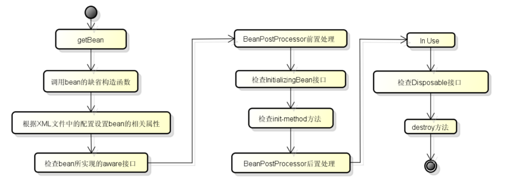

## 全家桶内容


# IOC

容器负责组件的装配

在要用到的属性前面加@autowired,也可以在构造方法或者set方法


​	控制反转是把传统上由程序代码直接操控的对象的调用权交给容器，通过容器来实现对象组件的装配和管理。也就是说资源不是由使用资源的双方管理，而是由不使用资源的第三方管理


## 依赖查找(DL)

所在的类实现ApplicationContextAware接口，然后通过重写setApplicationContext方法获取到容器，

接着用容器的getBean方法置顶文件名,比如AlphaService.class

已经被抛弃，因为他需要用户自己去是使用 API 进行查找资源和组装对象。即有侵入性


## 依赖注入(DI)

是对IOC更简单的诠释把

​	依赖注入的基本原则是应用组件不应该负责查找资源或者其他依赖的协作对象。配置对象的工作应该由容器负责，查找资源的逻辑应该从应用组件的代码中抽取出来，交给容器来完成。DI是对IoC更准确的描述，即组件之间的依赖关系由容器在运行期决定，形象的来说，即由容器动态的将某种依赖关系注入到组件之中


# IOC的原理


# 实现IOC

1. 定义用来描述bean的配置的Java类
2. 解析bean的配置，將bean的配置信息转换为上面的BeanDefinition对象保存在内存中，spring中采用HashMap进行对象存储，其中会用到一些xml解析技术
3. 遍历存放BeanDefinition的HashMap对象，逐条取出BeanDefinition对象，获取bean的配置信息，利用Java的反射机制实例化对象，將实例化后的对象保存在另外一个Map中即可。


# IOC的好处

1. 降低类与类之间的耦合性
2. 提高系统可插入、可测试、可修改等特性。


# AOP

就是由容器控制程序之间的关系，而非传统实现中，由程序代码直接操控。这也就是所谓“控制反转”的概念所在。控制权由应用代码中转到了外部容器，控制权的转移是所谓反转。

IoC还有另外一个名字——“依赖注入（Dependency Injection）”。从名字上理解，所谓依赖注入，即组件之间的依赖关系由容器在运行期决定，形象地说，即由容器动态地将某种依赖关系注入到组件之中

面向切面编程

对OOP的补充

进一步提高编程的效率

​	程序中有多个业务模块，而这几个业务都有相同的系统需求，比如统一做权限检查，记录日志，事务管理，使用AOP可以统一解决，只需要定义一个组件，这个组件和业务组件不发生任何直接发生，不用再业务组件里面调用它，只是额外定义了一个系统的组件，把几个业务组件需要的系统需求定义进去，画成图来看就像这个组件横跨、横向扩展了几个业务组件

​	要处理的业务组件Bean叫做target,采用AOP是把代码写在一个组件里，这个组件就叫切面，那么如果业务组件怎么知道呢，所以需要把组件织入业务中，有三种织入方式：

1. 编译时织入，需使用特殊的编译器。
2. 装载时织入，需使用特殊的类加载器
3. 运行时织入，需

越原始，运行时已经织好了，运行时速度比较快，但是织入的时机比较早，有些特殊情况处理得不惊喜

运行时织入所有条件已经知道，但是边运行边织入就比较慢


可以织入到属性里，构造器里，静态块里，成员方法里，目标对象允许织入的位置叫JoinPoint

Advice通知，实现具体的系统逻辑，到底做什么，而且是在那里，比如前，后，返回，异常


​	总结：程序当中的处理业务逻辑的Bean叫目标对象，目标对象上能够被织入代码的位置叫做连接点，AOP解决统一处理这些系统需求的方式是定义到一个组件里，叫做方面组件，方面组件在运行前，就

必须织入到某些连接点上，方面组件里在Pointcut里先声明切点，声明好哪些织入对象的哪些位置，需要再写上通知类的方法来声明方面组件要处理声明逻辑


- AspectJ

  是语言级的实现，拓展了JAVA语言，定义了AOP语法

  在编译器织入代码，有一个专门的编译器，用来生成遵守JAVA字节码规范的CLASS文件

- Spring AOP

  使用纯JAVA实现，不需要专门的编译过程，也不需要特殊的类装载器

  在运行时通过代理的方式织入代码，只支持方法类型的连接点，性价比最高的方式

  支持对AspectJ的集成


代理：

- JDK动态代理

  JAVA自带的动态代理技术，

  有一个要求，某一个对象生成一个代理对象代理它，调用的时候调用代理对象而不用原始对象，织入代码的时候是织入到代理对象里面,而Spring的Bean都是通过容器去调，调的时候一看有AOP的作用就知道要调用代理对象，而代理对象又有织入的代码就能解决问题，要求目标对象有接口才能调用，在运行时创建接口的代理实例

  Spring AOP默认采用这种方式，在接口的代理实例中织入代码。但是如果目标没有接口，那么就使用：

- CGLib动态代理

  采用底层的字节码技术，在运行时创建子类代理实例

  当目标对象不存在接口时，Spring AOP会采用这种方式，在子类实例中织入代码

  


## 操作方式

Core组件是用于发现、简历和维护每个Bean之间的关系所需要的一系列工具


# @Resource和@Autowired区别

1、共同点

两者都可以写在字段和setter方法上。两者如果都写在字段上，那么就不需要再写setter方法。

2、不同点

（1）@Autowired

@Autowired为Spring提供的注解;只按照类型注入。

@Autowired注解是按照类型（byType）装配依赖对象，默认情况下它要求依赖对象必须存在，如果允许null值，可以设置它的required属性为false。如果我们想使用按照名称（byName）来装配，可以结合@Qualifier注解一起使用。

（2）@Resource

@Resource默认按照ByName自动注入，由J2EE提供。

@Resource有两个重要的属性：name和type，而Spring将@Resource注解的name属性解析为bean的名字，而type属性则解析为bean的类型。所以，如果使用name属性，则使用byName的自动注入策略，而使用type属性时则使用byType自动注入策略。如果既不制定name也不制定type属性，这时将通过反射机制使用byName自动注入策略。


# Bean的生命周期




# 核心组件

Context

Bean

Core


# 事务管理

- 声明式事务

  -通过XML配置，声明某方法的事务特征

  -通过注解，声明某方法的事务特征

  事务的传播机制，

  REQUIRED，支持当前事务（A调B，A就是当前事务），如果不存在则创建新事务

  REQUIRED_NEW,创建一个新事务，并且暂停外部事务

  NESTED,如果当前存在事务，则嵌套在该事务中执行（有独立的提交和回滚），否则就和REQUIRED一样

  比如@Transilation(isolation=Isolation.READ_COMMITED ,propagation = Propagation.REQUIRED)

- 编程式事务

  -通过Transaction Template管理事务，并通过它执行数据库的操作

  ```java
      public Object save2() {
          transactionTemplate.setIsolationLevel(TransactionDefinition.ISOLATION_READ_COMMITTED);
          transactionTemplate.setPropagationBehavior(TransactionDefinition.PROPAGATION_REQUIRED);
  
          return transactionTemplate.execute(new TransactionCallback<Object>() {
              @Override
              public Object doInTransaction(TransactionStatus status) {
                  // 新增用户
                  User user = new User();
                  user.setUsername("beta");
                  user.setSalt(CommunityUtil.generateUUID().substring(0, 5));
                  user.setPassword(CommunityUtil.md5("123" + user.getSalt()));
                  user.setEmail("beta@qq.com");
                  user.setHeaderUrl("http://image.nowcoder.com/head/999t.png");
                  user.setCreateTime(new Date());
                  userMapper.insertUser(user);
  
                  // 新增帖子
                  DiscussPost post = new DiscussPost();
                  post.setUserId(user.getId());
                  post.setTitle("你好");
                  post.setContent("我是新人!");
                  post.setCreateTime(new Date());
                  discussPostMapper.insertDiscussPost(post);
  
                  Integer.valueOf("abc");
  
                  return "ok";
              }
          });
      }
  ```
  
  
  
  