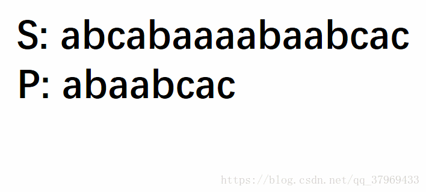
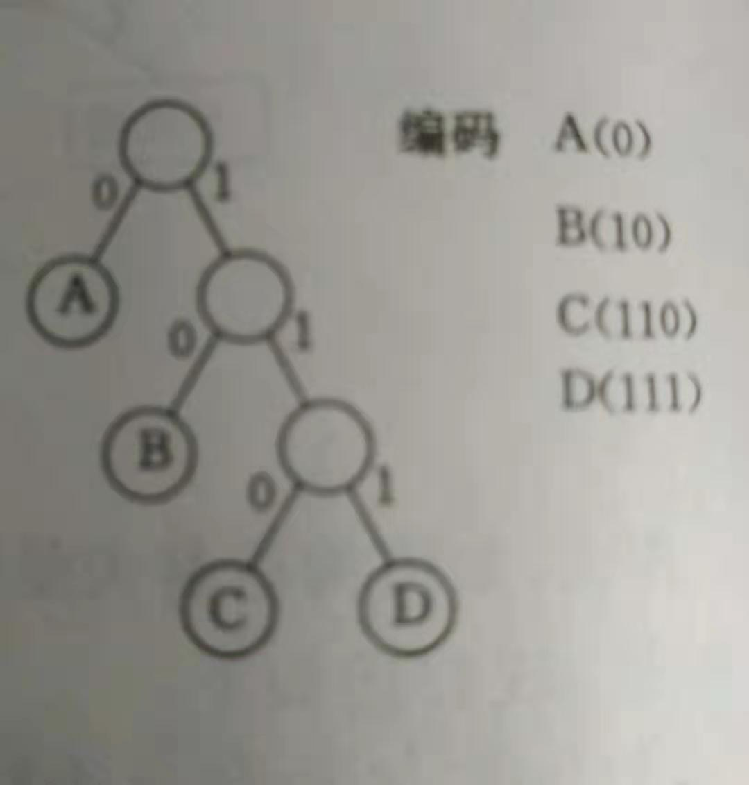

# 链表

## 与数组区别

1. 存储位置

2. 增

3. 删

4. 查

5. 改

 

# 队列

注意事项，

1. 队空时，头尾指针应该相等

2. 堆满时，头指针应该正好在尾指针后一位

3. 入队时，尾指针加一

4. 出队时，头指针加一

   


# 字符串

## 1.朴素匹配(暴力法)

时间复杂度O(mn)

给定一个主串S及一个模式串P，判断模式串是否为主串的子串；若是，返回匹配的第一个元素的位置，否则返回-1,以S=“abcabaaaabaaacac”,P="abaabcac"为例



```java
//备注，数据结构书中，C语言数组第一个元素用于存储字符串的长度，所以课本中索引会从1开始
//这里由于JAVA的数组有lenth属性，所以不必将长度存储在第一个位置，数组可以全部存字符
    int index(char[] str1, char[] str2, int pos) {
        if(pos<0 || pos>=str1.length) return -1;

        int i = pos, j = 0;
        while (i < str1.length && j < str2.length) {
            if(str1[i]==str2[j]) {++i;++j;}
            else                 {i=i-j+1;j=0;}
        }
        if(j>=str2.length) return j-str2.length;
        return -1;
    }
```

## 2.KMP算法

串和模式串从头开始匹配，如果匹配相同，则继续往右匹配，如果匹配不同的话，就将模式串右移X位，接着匹配。X位=失配字符位置-失配字符对应的next值

[KMP算法详解](https://www.cnblogs.com/zhangtianq/p/5839909.html)

```java
int KMP_index(char[] s, char[] m) {
      if (s == null || m == null || m.length() < 1 || s.length() < m.length()) {
			return -1;
		}
		char[] str1 = s.toCharArray();
		char[] str2 = m.toCharArray();
		int i1 = 0;
		int i2 = 0;
		int[] next = getNextArray(str2);
		while (i1 < str1.length && i2 < str2.length) {
			if (str1[i1] == str2[i2]) {
				i1++;
				i2++;
			} else if (next[i2] == -1) {
				i1++;
			} else {
				i2 = next[i2];
			}
		}
		return i2 == str2.length ? i1 - i2 : -1;
    }
```

## 3.Next数组

跟KMP差不多也是用双指针来求。

将NEXT【0】 赋值为-1，将前缀指针指向索引-1，后缀指向索引0

如果前缀指针索引为-1或者前缀指针所指字符与后缀指针所指字符相同，当前NEXT值就等于前一次匹配相同的值+1

否则就将前缀指针退回到对应NEXT的位置，即是说，通过判断前缀指针-1字符的最大前后缀值来查找是否有与本身相同的字符,这用的是前子串的对称性

```java
int[] getNextArray(int[] ms) {
     if (ms.length == 1) {
			return new int[] { -1 };
		}
		int[] next = new int[ms.length];
		next[0] = -1;
		next[1] = 0;
		int i = 2;
		int cn = 0;
		while (i < next.length) {
			if (ms[i - 1] == ms[cn]) {
				next[i++] = ++cn;
			} else if (cn > 0) {
				cn = next[cn];
			} else {
				next[i++] = 0;
			}
		}
		return next;
    }
```

# 二叉树

## 1.非递归先序遍历

```java
 ArrayList<Integer> PreOrderTraverse(TreeNode root) {
        ArrayList<Integer> list = new ArrayList<>();
        if (root == null) return list;

        Stack<TreeNode> stack = new Stack<>();
        stack.push(root);

        while (!stack.isEmpty()) {
            TreeNode p = stack.pop();
            list.add(p.val);
            if (p.right != null)
                stack.push(p.right);
            if (p.left != null)
                stack.push(p.left);
        }
        return list;
    }
```

## 2.非递归中序遍历

```java
ArrayList<Integer> InOrderTraverse(TreeNode root) {
        ArrayList<Integer> list = new ArrayList<>();
        if (root == null) return list;

        Stack<TreeNode> stack = new Stack<>();
        TreeNode cur = root;

        while ((!stack.isEmpty()) || cur != null) {
            while (cur != null) {//走到最左边
                stack.push(cur);
                cur = cur.left;
            }
            cur = stack.pop();
            list.add(cur.val);
            cur = cur.right;
        }
        return list;
    }
```

## 3.非递归后序遍历

后续遍历是左--右-根，如果直接做会很麻烦，换个思路，先求根-右-左(跟先序遍历差不多)，然后再转置即可

```java
ArrayList<Integer> PostOrderTraverse(TreeNode root) {
        ArrayList<Integer> list = new ArrayList<>();
        if (root == null) return list;

        Stack<TreeNode> stack = new Stack<>();
        stack.push(root);

        while (!stack.isEmpty()) {
            TreeNode p = stack.pop();
            list.add(p.val);
            if (p.left != null)
                stack.push(p.left);
            if (p.right != null)
                stack.push(p.right);
        }
        Collections.reverse(list);
        return list;
    }
```

## 4.层次遍历

```java
 ArrayList<Integer> LevelTravel(TreeNode root) {
        ArrayList<Integer> list = new ArrayList<>();
        if (root == null) return list;

        LinkedList<TreeNode> queue = new LinkedList<>();
        queue.add(root);
        while (!queue.isEmpty()) {
            TreeNode cur = queue.poll();
            list.add(cur.val);
            if (cur.left != null)
                queue.add(cur.left);
            if (cur.right != null)
                queue.add(cur.right);
        }

        return list;
    }
```

# 二叉查找树

## 1.插入

按照左小右大的特点一直查找插入位置，查找到空结点，然后将其插入

## 2.删除

1. 被删除结点无子树，直接删除即可

2. 被删结点只有一个子树，那个就将该子树赋值给被删结点父节点

3. 左右子树均不空，找到其直接前驱，然后将被删结点赋值为直接前驱，删除原直接前驱


## 3.特点

1. 左子树小于等于根节点

2. 右子树大于等于根节点

3. 左右子树也是二叉查找树

# AVL树/平衡二叉树

## 1.原因

因为在数据非递增或者非递减的情况下，二叉查找树会退化成一条链表的形式

## 2.特点

特殊的二叉查找树

每个结点的左右子树高度差至多为1

## 3.调整方式

### LL型

失衡在LL(左子树的左节点上)，执行右旋


### RR型

失衡在RR(右子树的右节点上)，执行左旋


### LR型

在左子树的右节点上，应先左旋，再右旋

### RL型

在右子树的左节点上，应先右旋，再左旋

# 红黑树

是一种特殊的二叉查找树

## 1.原因

平衡二叉树要求每个结点的左子树和右子树的高度差最多等于1，这个要求太严格，导致每次插入/删除结点，几乎都会破坏这个规则，需要进行左旋或者右旋，换句话说，就是不适用于频繁插入和删除的场景

## 2.特点

1. 结点是红色或者黑色

2. 根结点是黑色

3. 叶子结点都是黑色的空节点

4. 红色结点的两个子节点都是黑色(也就是说叶子到根节点的所有路径不能有两个连续的红色结点)

5. 从任一结点到他的每个叶子的所有路径都包含相同数目的黑色结点

6. 总结：从根节点到叶子节点的最长路径不可能大于最短路径的2倍


## 3.插入

[红黑树插入删除详解]([https://en.wikipedia.org/wiki/Red%E2%80%93black_tree](https://en.wikipedia.org/wiki/Red–black_tree))

先按照二叉查找树的规律插入，然后调整，调整规律如下

1.  插入节点是根节点。
   - 直接把此节点涂为黑色。
2. 插入节点的父节点是黑色。
   - 什么也不需要做。节点被插入后，仍然是红黑树。
3. 插入的节点的父节点是红色，叔叔结点也是红色的
   - 将“父节点”、"叔叔结点"设为黑色。
   - 将“祖父节点”设为“红色”。
   - 将“祖父节点”设为“当前节点”(也就是红色节点)，然后继续对“当前节点”进行操作。
4. 插入节点的父节点是红色，叔叔结点也是黑色的
   - 第一步，分为3种情况
     1. 若插入结点是父节点的右节点，并且父节点是祖父结点的左结点，那么先左旋父节点，再将当前节点设置设为插入结点的左结点，然后进入第二步
     2. 若插入结点是父节点的左节点，并且父节点是祖父结点的右结点，那么先右旋父节点，再将当前节点设置设为插入结点的右结点，然后进入第二步
     3. 非以上两种情况，直接进入第二步
   - 第二步
     - 若当前结点是父节点的左节点，就右旋祖父
     - 否则左旋祖父
   - 第三步
     - 将父节点设为黑色，祖父结点设为红色

## 4.删除

[RB树删除详解](https://www.cnblogs.com/shilinnpu/p/8876961.html)

三类九种

准备工作：

若1删除结点左右节点均不为空，拷贝直接前驱的数据到删除结点((不改变颜色)，变成类3

左右均为空则将其中一个空当做他的孩子，变成类3


- 类2：若删除的结点只有一个孩子
  - 2-1：删除结点为红色，那么他的父亲和孩子一定是黑色的，直接删除他就好了
  - 2-2：删除结点是黑色且他的孩子是红色，那么将孩子染为红色再替换
  - 2-3：若删除结点是黑色，他的孩子也是黑色，此时有6种情况（先声明以下所有结点指代删除结点+父节点+兄弟节点+兄弟节点的左右节点）
    - 2-3-1：若删除节点是根节点，直接删去即可
    - 2-3-2：除兄弟为红色，其他均为黑色，那么对父节点左旋，然后交换原父节点和原兄弟节点的颜色，然后进入情况4,5,6处理
    - 2-3-3：所有的节点均为黑色，把兄弟节点染红，然后进入情况2
    - 2-3-4：父节点是红色，其他节点是黑色，那么交换父节点和兄弟节点的颜色
    - 2-3-5：父节点为任意颜色，兄弟节点为黑色，兄弟节点的左孩子为红色，右孩子为黑色，且删除结点是父节点的左孩子，那么对兄弟节点右旋，交换原兄弟节点和原兄弟节点的左孩子的颜色，然后进入情况6
    - 2-3-6：父节点为任意颜色，兄弟节点为黑色，兄弟节点的右孩子为红色，且删除结点是父节点的左孩子，那么对父节点左旋，交换父节点和兄弟节点的颜色，然后变兄弟节点的右孩子颜色为黑色


# 2-3树

## 1.特点

严格平衡

核心是一个结点至多存储2个值，左小，右大，中等

## 2.插入

3个值就必须分裂（视情况融合）//很多教材在同时有分裂融合时直接把分裂的步骤省略

示例：向空2-3树依次插入1， 2， 3， 4，5


# 赫夫曼树

## 1.建树


## 2.赫夫曼编码

# B树

## 操作

进行查找操作时，首先在根节点进行二分查找，找到一个 key 所在的指针，然后递归地在指针所指向的节点进行查找。直到查找到叶子节点，然后在叶子节点上进行二分查找，找出 key 所对应的 data。

插入删除操作会破坏平衡树的平衡性，因此在插入删除操作之后，需要对树进行一个分裂、合并、旋转等操作来维护平衡性。


## 特点

1.关键字分布在整个树

2.任何一个关键字出现且只出现在一个结点中

3.搜索有可能在非叶子节点结束

# B+树

## 1.特点

[B+树详解](https://mp.weixin.qq.com/s/jRZMMONW3QP43dsDKIV9VQ)

1.有k个子树的中间节点包含有k个元素（B树中是k-1个元素），中间结点不保存数据，只用来索引，所有数据都保存在叶子节点，而且非叶子仅包含子树中的最大（最小结点）

2.所有的叶子结点中包含了全部关键字的信息，以及指向关键字记录的指针，叶子结点本身依关键字的大小自小而大顺序链接

3.搜索必须在叶子结束

## 2.B+树相比B树的优势

1.单一结点存储更多的元素，使得查询的IO次数更少。

2.所有查询都要查找到叶子节点，查询性能稳定。

3.所有叶子节点形成有序链表，便于范围查询。

# 图论

## 判断是否有环方法

1.深度优先搜索算法，设置结点访问FLAG，访问过则无环

2.拓扑排序，能成功则无环


## DFS(深度优先搜索算法)

时间复杂度O（n²）,类似树的先序遍历，常用于迷宫

访问顶点，然后对某一邻接顶点检查，以这个新顶点进行递归(即是一条路走到死再回头)


## BFS(广度优先搜索算法)

时间复杂度O（n²）,类似树的层次遍历

从指定顶点V出发，先访问该顶点，然后依次访问V的所有未被访问的邻接顶点，然后再按之前林及定点被访问的先后次序依次访问他们的未被访问的临街顶点，以此类推，知道所有从V可被访问为止


## 拓扑排序

### 1.基于DFS

将顶点按访问的先后顺序入栈，栈中自顶向下即为拓扑排序

### 2.减治

1.先找入度为0的点做为起源点，将其取出，整个图还是无环图

2.重复1操作直到所有的点被取出

如果找不到新的源点，那么他就是有环图


## Prim算法

将所给的点作为开始点，然后解锁它的所有边放入最小堆，在堆里面找最小值，如果最小值两边的点都已经是访问过的，那么舍弃，然后再从堆里取，循环这个操作，直到堆里没有边或者直到所有的点都被取完


## Kruskal算法

排序所有的边，由小到大取出边，取的时候有这样几条原则：

1.不能是已经到达过的点

2.不能产生环

也就是说，不符合原则的边就舍弃掉，直到所有的边都被取完或者直到所有的点都被取完


## Dijkstra算法

首先初始化出发点到本身为0，到其他点为无穷

然后选最小距离且没有被选过的点，遍历它的边集，根据遍历结果再加上到它的距离，对初始化内容进行更新

依次对所有的点这样操作，最后就可以得到出发点到各个点的距离


## 佛洛依德算法

对每个顶点都进行迪杰斯特拉算法


## 关键路径法

[关键路径法详解](http://www.360doc.com/content/18/0131/20/26447790_726771377.shtml)

[关键路径法实操](https://blog.csdn.net/qq_35455503/article/details/79696454)

关键路径项目中最长的路径

1、计算每个事件可能的最早发生时间

2、计算每个事件允许的最迟发生时间

3、输出关键活动

最早发生时间和最迟发生时间相等的事件，一般就是关键活动。

从源点到汇点具有最大长度的路径叫关键路径，在关键路径上的活动称为关键活动。


# 并查集

[并查集详解](https://github.com/CyC2018/CS-Notes/blob/master/notes/算法 - 并查集.md)

用于解决动态连通性问题，能动态连接两个点，并且判断两个点是否连通。

## 快速查找

### 1.特点

同一个图每个结点都直接写出他们的开始点

（如 "张无忌"<-“杨青牛”    "张无忌"<-“杨左使”    "张无忌"<-“张无忌” ）

### 2.查找

如果要判断是否连通，直接求两个结点的最开始点是否相同即可，时间复杂度为O(1)

### 3.合并

但是合并的时候会很麻烦，需要把每个点都改成另外一个图的开始点，时间复杂度O(n)

## 快速合并

### 1.特点

每个点只有直接前继点

（如“张无忌"<-“杨左使” <-“杨青牛” ）

### 2.查找

如果要判断是否连通，需要一步步往上走到最开始点，时间复杂度为O(n)

### 3.合并

直接将遍历到最开始点，然后将一个开始点连接到另一个开始点就好了，时间复杂度O(logn)


# 哈希表

## 1.建表方式

一般都是用除留余数法

## 2.解决冲突方法

​	(1)开放定址法

​	(2)再哈希法

​	(3)链地址法

​	(4)公共溢出区法

