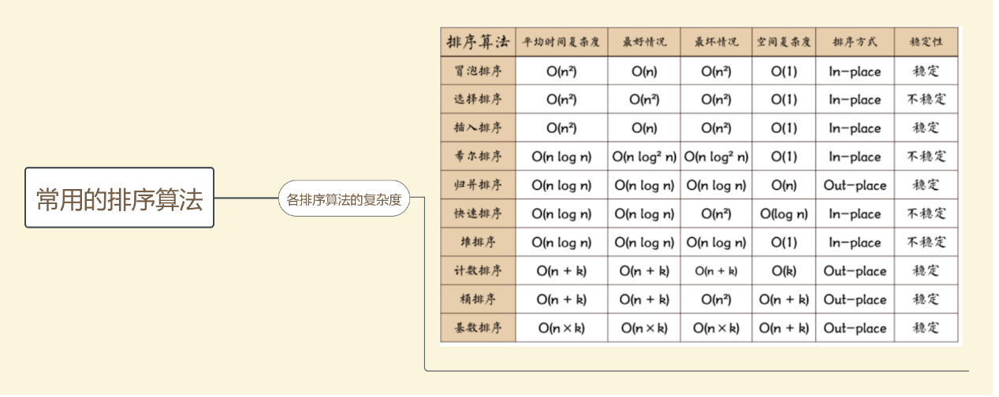

# 冒泡排序

思想：比较相邻的元素。如果第一个比第二个大,就交换他们两个。 对每一对相邻元素做同样的工作,从开始第一对到结尾的最后一对。在这一点,最后的元素应该会是最大的数。 针对所有的元素重复以上的步骤,除了最后一个。 持续每次对越来越少的元素重复上面的步骤,直到没有任何一对数字需要比较。”

时间复杂度O（n²）

```java
 private void BubbleSort(int[] a) {
        int len = a.length;
        for (int i = 0; i < len - 1; i++) {
            for (int j = i + 1; j < len; j++) 
                if (a[j] < a[i]) 
                    swap(a, i, j);
        }
    }
```

# 选择排序

思想：每一趟在n-i+1个记录中选取关键字最小的记录作为有序序列第i个记录

时间复杂度O（n²）

```java
private void SelectionSort(int[] a) {
        int len = a.length;
        for (int i = 0; i < len - 1; i++) {
            int min = i;
            for (int j = i + 1; j < len; j++) 
                if (a[j] < a[min])
                    min=j;
            swap(a,i,min);
        }
    }
```

# 插入排序

时间复杂度O（n²），最差是O（n²），最优是O（n）

思想:将一个记录插入到已排序的有序表，从而得到一个新的、记录数增1的有序表

```java
private void InsertionSort(int[] a) {
        for (int i = 0; i < a.length; ++i) {
            int temp = a[i];
            int j = i - 1;
            while (j >= 0 && a[j] > temp) {//从右向左找第一个小于等于v的数
                a[j + 1] = a[j];//右移操作
                --j;
            }
            a[j + 1] = temp;//插入找到的位置(比小的元素索引加一)
        }
    }
```

# 希尔排序

思想：将整个待排记录序列分割成为若干子序列分别进行直接插入排序，待整个序列中的记录“"基本有序"时，再对全体记录进行一次直接插入排序

```java
private void ShellSort(int[] a) {
        for (int increment = a.length / 2; increment > 0; increment /= 2) {
            for (int i = increment; i < a.length; ++i) {
                int temp = a[i];
                int j = i;
                while (j >= increment && temp < a[j - increment]) {
                    a[j] = a[j - increment];//插入排序操作，右移操作
                    j -= increment;
                }
            }
        }
    }
```

# 归并排序

时间复杂度O（logn），最差是O（logn），最优是O（logn)

思想：核心操作将两个有序数组合并成1个，先把数组不断等分，直至数组只剩一个元素，开始两两合并。

```java
void MergeSort(int[] a) {
    int len = a.length;
    int[] temp = new int[len];
    Help(a, temp, 0, len - 1);
}

void Help(int[] a, int[] temp, int l, int r) {
    if (l < r) {
        int mid = (l + r) >>> 1;
        Help(a, temp, l, mid);
        Help(a, temp, mid + 1, r);
        Merge(a,temp,l,mid,r);
    }
}

void Merge(int[] a, int[] temp, int left, int mid, int right) {
    int l = left, r = mid + 1, k = left;
    while (l <= mid && r <= right) {
        if (a[l] <= a[r]) temp[k++] = a[l++];
        else temp[k++] = a[r++];
    }
    while (l <= mid) temp[k++] = a[l++];
    while (r <= right) temp[k++] = a[r++];
    for (int i = left; i <= right; i++)
        a[i] = temp[i];
}
```

# 快速排序

思想：

在数据集之中，选择一个元素作为“基准”。

所有小于“基准”的元素，都移到“基准”的左边；所有大于“基准”的元素，都移到“基准”的右边。

对“基准”左边和右边的两个子集，不断重复第一步和第二步，直到所有子集只剩下一个元素为止。

```java
 private int Partition(int[] a, int low, int high) {
        int temp = a[low];
        while (low < high) {
            while (low < high && temp <= a[high]) high--;
            a[low] = a[high];
            while (low < high && temp > a[low]) low++;
            a[high] = a[low];
        }
        a[low] = temp;
        return low;
    }

    private void QuickSortHelp(int[] a, int low, int high) {
        /*递归实现*/
        if (low < high) {
            int middle = Partition(a, low, high);
            QuickSortHelp(a, low, middle - 1);
            QuickSortHelp(a, middle + 1, high);
        }
    }

    private void QuickSort(int[] a) {
        QuickSortHelp(a, 0, a.length - 1);
    }
```

# 计数排序

计数排序适用于有明确范围的数组，如公司员工年龄排序

```java
private void CountingSort(int[] a) {
        //求出最小值，最大值
        int min = Integer.MAX_VALUE;
        int max = Integer.MIN_VALUE;
        for (int i = 0; i < a.length; i++) {
            max = Math.max(max, a[i]);
            min = Math.min(min, a[i]);
        }


        int[] rate = new int[max - min + 1];//初始化频率数组为0
        for (int value : a)//计算频率
            rate[value - min] += 1;
        for (int i = 1; i < rate.length; i++)//重分布
            rate[i] += rate[i - 1];

        int[] temp = new int[a.length];
        for (int i = a.length - 1; i >= 0; i--) {
            int pos = a[i] - min;
            temp[rate[pos] - 1] = a[i];
            rate[pos]--;
        }
        for (int i = 0; i < a.length; i++)//copy back
            a[i] = temp[i];

    }
```

# 基数排序 

[基数排序详解](https://mp.weixin.qq.com/s/WLh-ovG_5n6AOFAkRSyA-g)

主要用于字符串排序

思想：对每个字符串

# 桶排序

[桶排序详解](https://mp.weixin.qq.com/s/qrboxA5SwN7AbAcpZ_dpNQ)

思想：有多少个元素就建立多少个桶，除了最后一个桶只包含数列最大值，前面的各个桶的区间按照比例确定，也就是区间跨度=（最大值-最小值）/(桶数量-1)，然后遍历数组，把元素对号入座放入桶中，再对各个桶进行排序，最后遍历所有的桶，输出所有的元素

```java


```

# 外部排序

[详解外部排序](http://www.sohu.com/a/258751244_818692)

使用外部排序的原因：数据量太大，内存无法容纳

不同的外部排序方法其实都是归并排序，只不过是生成的子串数量不同

## 1.二路归并排序

时间复杂度：内部排序时间+外部读写时间+内部归并时间

①先按内存大小，将数据等分，每份数据先单独进行排序

②然后将数据两两合并，直至最后成为一个有序的序列

## 2.多路平衡归并排序(败者树)

①先按内存大小，将数据等分，每份数据先单独进行排序

②利用败者树合并所有的数据

这里讲解下败者树：败者树是一种二叉树，结点存的是每份数据的索引（比如第一份数据，第二份数据），每一个父结点存的是左右结点的较小者

## 3.置换选择排序

①建立小顶堆，读入内存大小的数据，取出最小的数放入子串

②接着读取一数，若该数大于子串最后一个数，则放入堆,调整堆，然后取出新的堆顶放入子串

③否则将其放在堆最后一个位置，然后减少堆的大小，取出堆顶放入子串，回到第二步，直至堆大小为0，这样就生成第一份数据了，再重新回到①，直至所有的数据生成完毕

## 4.最佳归并树

其实就是K叉哈夫曼树

对于K路归并而言，当(m-1)mod(k-1)=0满足K叉归并树      //m值为归并段

数据量不满足K叉，则需要补充k  -  (m-1)mod(k-1)-1个虚段

也就是说，一开始，需要建立(m-1)mod(k-1)+1路归并

## 5.总结

总的来说，外部排序分为两步：

①生成子串(可以直接等分然后内部排序，或者使用置换选择排序)

②合并(有二路归并，败者树，最佳归并树	)

# 二分查找

时间复杂度O(logn)

```java
int BinarySearch(int[] a, int target) {
    if (a == null || a.length == 0) return -1;

    int l = 0, r = a.length - 1;
    while (l < r) {
        int mid = (l + r) >>> 1;
        if (a[mid] < target) l = mid + 1;
        else                 r=mid;
    }
    if(target==a[l])  return l;
    else              return -1;
}
```

