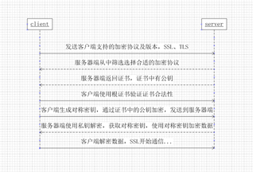

# 从输入网址到浏览器渲染页面的过程

1. 根据域名查询域名的IP地址，DNS解析。
2. TCP连接
3. 发送HTTP请求
4. 服务器处理请求并返回HTTP报文
5. 浏览器解析渲染页面
6. 连接结束。


​	使用的协议：

DNS(获取域名的IP的地址);

TCP(与服务器建立TCP连接)；

IP(建立TCP协议时，需发送数据，在网络层用到IP协议)；

OPSF(IP数据包在路由之间传送，路由选择使用OPSF协议)；

ARP(路由器与服务器通信时，将IP地址转化为MAC地址，使用ARP协议)

HTTP(TCP建立之后，使用HTTP协议访问网页)；


# DNS寻址

先查找**浏览器缓存**，

如果没命中，查询**系统缓存**，即hosts文件。

如果没命中，查询**路由器缓存**。

如果没命中，请求**本地域名服务器解析域名**

没有命中就进入**根服务器**进行查询。

没有命中就返回**顶级域名服务器IP**给**本地DNS服务器**。

本地DNS服务器请求顶级域名服务器解析，

没有命中就返回**主域名服务器**给本地DNS服务器。

本地DNS服务器请求**主域名服务器解析域名**，将结果返回给本地域名服务器。

本地域名服务器缓存结果并反馈给客户端。


## 递归调用和迭代调用

### 一、主机向本地域名服务器的查询一般都是采用递归查询。

​    所谓递归查询就是：如果主机所询问的本地域名服务器不知道被查询的域名的IP地址，那么本地域名服务器就以DNS客户的身份， 向其它根域名服务器继续发出查询请求报文(即替主机继续查询)，而不是让主机自己进行下一步查询。因此，递归查询返回的查询结果或者是所要查询的IP地址，或者是报错，表示无法查询到所需的IP地址。

 

### 二、本地域名服务器向根域名服务器的查询的迭代查询。

​    迭代查询的特点：当根域名服务器收到本地域名服务器发出的迭代查询请求报文时，要么给出所要查询的IP地址，要么告诉本地服务器：“你下一步应当向哪一个域名服务器进行查询”。

​    然后让本地服务器进行后续的查询。根域名服务器通常是把自己知道的顶级域名服务器的IP地址告诉本地域名服务器，让本地域名服务器再向顶级域名服务器查询。

​    顶级域名服务器在收到本地域名服务器的查询请求后，要么给出所要查询的IP地址，要么告诉本地服务器下一步应当向哪一个权限域名服务器进行查询。

​    最后，知道了所要解析的IP地址或报错，然后把这个结果返回给发起查询的主机


# URI和URL区别

[*************URI和URL区别详解******************](https://blog.csdn.net/simplebam/article/details/72644094)


# http1.0和http1.1区别

以下均是1.1有，1.0无的

1. 在HTTP1.0中主要使用header里的If-Modified-Since,Expires来做为缓存判断的标准

   HTTP1.1则引入了更多的缓存控制策略例如If-MATCH

2. 支持断点续传

3. 1.0请求的url并没有传递主机名(服务器与IP地址绑定)

   1.1请求和响应都支持Host头域(虚拟主机共享IP地址)

4. 长连接，减少了建立和关闭连接的消耗和延迟。

5. 长连接让管线化发送成为可能。从前发送请求后需等待并收到响应，才能发送下一个请求（流水线）。管线化技术出现后，不用等待响应即可直接发送下一个请求。

   

###  短连接与长连接区别

因为HTTP请求是建立在TCP连接之上的，如果每进行一次 HTTP 通信就要新建一个 TCP 连接，那么开销会很大（短连接就是这样）。

长连接只需要建立一次 TCP 连接就能进行多次 HTTP 通信。

- 从 HTTP/1.1 开始默认是长连接的，如果要断开连接，需要由客户端或者服务器端提出断开，使用 `Connection : close`；
- 在 HTTP/1.1 之前默认是短连接的，如果需要使用长连接，则使用 `Connection : Keep-Alive`。


# http1.1和http2.0区别

1、新的传输格式

​	2.0使用二进制格式，1.0依然使用基于文本格式
2、多路复用

​	连接共享，不同的request可以使用同一个连接传输（最后根据每个request上的id号组合成正常的请求）
3、header压缩

​	由于1.X中header带有大量的信息，并且得重复传输，2.0使用encoder来减少需要传输的hearder大小
4、服务端推送


# HTTP首部字段

## HTTP请求报文

在请求中,HTTP报文由方法、URI、HTTP版本、HTTP首部字段等部分构成。

1. 请求方法

2. 请求URI

3. HTTP版本

4. 可选的请求首部字段和内容实体

   


## HTTP响应报文

在响应中，HTTP报文由HTTP版本、状态码、HTTP首部字段构成

1. HTTP版本
2. 状态码
3. 原因短语
4. 可选的响应首部字段和实体主体


## 通用首部字段

首部字段名	说明
Catch-Control	控制缓存的行为
Connection	逐条首部、连接的管理
Date	创建报文的日期时间
Pragma	报文指令
Trailer	报文末端的首部一览
Transfer-Encoding	指定报文主体的传输编码方式
Upgrade	升级为其他协议
Via	代理服务器的相关信息
Warning	错误通知

## 请求首部字段

首部字段名	说明
Accept	用户代理可处理的媒体类型
Accept-Charset	优先的字符集
Accept-Enconding	优先的内容编码
Accept-Language	优先的语言（自然语言）
Authorization	Web认证信息
Expect	期待服务器的特定行为
From	用户的电子邮箱地址
Host	请求资源所在服务器
If-Match	比较实体标记（ETag）
If-Modified-Since	比较资源的更新时间
IF-None-Match	比较实体标记（与IF-Match相反）
If-Range	资源未更新时发送实体Byte的范围请求
If-Unmodified-Since	比较资源的更新时间（与If-Modified-Since相反）
Max-Forwards	最大传输逐跳数
Proxy-Authorization	代理服务器要求客户端的认证信息
Range	实体的字节范围请求
Referer	对请求中URI的原始获取方
TE	传输编码的优先级
User-Agent	HTTP客户端程序的信息

## 响应首部字段

首部字段名	说明
Accept-Ranges	是否接受字节范围请求
Age	推算资源创建经过时间
ETag	资源的匹配信息
Location	令客户端重定向至指定URI
Proxy-Authenticate	代理服务器对客户端的认证信息
Retry-After	对再次发起请求的时机要求
Server	HTTP服务器的安装信息
Vary	代理服务器缓存的管理信息
WWW-Authenticate	服务器对客户端的认知信息

## 实体首部字段

首部字段名	说明
Allow	资源可支持的HTTP方法
Content-Encoding	实体主体适用的编码方式
Content-Language	实体主体的自然语言
Content-Length	实体主体的大小（单位：字节）
Content-Location	替代对应资源的URI
Content-MD5	实体主体的报文摘要
Content-Range	实体主体的位置范围
Content-Type	实体主体的媒体类型
Last-Modified	资源的最后修改日期
为Cookie服务的首部字段


## 首部字段名	说明	首部类型

Set-Cookie	开始状态管理所使用的Cookie信息	响应首部字段
Cookie	服务器接收到的Cookie信息	请求首部字段


# 状态码

备注：

状态码不一定和状态一致，有可能WEB应用程序内部发生错误，状态码依然返回200 OK，这种情况经常发生。


## 状态码类别

|      | 类别                           | 原因短语                   |
| ---- | ------------------------------ | -------------------------- |
| 1XX  | Information(信息性状态码)      | 接收的请求正在处理         |
| 2XX  | Success(成功状态码)            | 请求正常处理完毕           |
| 3XX  | Redirection(重定向)            | 需要进行附加操作以完成请求 |
| 4XX  | Client Error(客户端错误状态码) | 服务器无法处理请求         |
| 5XX  | Server Error(服务器错误状态码) | 服务器处理请求出错         |


## 1XX

### 100

客户端必须继续发出请求

### 101

客户端要求服务器转换HTTP协议版本

## 2XX

### 200OK

表示从客户端发来的请求在服务器端被正常处理了。


### 204No content

请求处理成功，但没有资源可返回。


### 206Patial Content

该状态码表示客户端进行了范围请求，而服务器成功执行了这部分的GET请求。


## 3XX

### 300请求资源在多处可得到

### 301永久性重定向

### 302临时性重定向

### 304请求的资源没有改变，可以使用缓存


## 301 和 302 什么区别？结合具体场景

​    301和302都是重定向状态码。说浏览器在拿到服务器返回的这个状态码后会自动跳转到一个新的URL地址，这个地址可以从响应的Location首部中获取。301永久重定向，表示旧地址的资源永久性移除了，搜索引擎在抓取新内容的同时也将旧的网址交换为重定向之后的网址。302临时重定向。表示旧地址A的资源还在（仍然可以访问），这个重定向只是临时地从旧地址A跳转到地址B，搜索引擎会抓取新的内容而保存旧的网址。

​    网页目录结构调整，网页扩展名调整，网页被移动到一个新的地址，这些都要永久重定向301.

如果网页调整是临时的，之后会调整过来，就用临时重定向302；


## 转发和重定向的区别

​	转发（forward）是服务器行为，重定向是客户端行为。
​	转发是服务器直接向目标地址访问URL,将相应内容读取之后发给浏览器，地址栏URL不变，转发页面和转发到的页面可以共享request里面的数据。效率高，可用于用户登录之后将角色转发到相应的模块。
​	重定向是利用服务器返回的状态码来实现的，如果服务器返回301或者302，浏览器到新的网址重新请求资源。地址栏url会发生改变，而且不能共享数据。效率低，可用于用户注销之后，跳转到其他网站。


## 4XX客户端错误

### 401要求认证信息或者认证失败

### 403禁止访问

### 404找不到

### 409对当前资源状态，请求不能完成


## 5XX服务器错误

### 500内部服务器错误

### 501未实现

### 502网关错误

### 503服务不可用

### 504网关超时


# HTTP基本性质

### HTTP 是简单的

虽然下一代HTTP/2协议将HTTP消息封装到了帧（frames）中，HTTP大体上还是被设计得简单易读。HTTP报文能够被人读懂，还允许简单测试，降低了门槛，对新人很友好。


### HTTP 是可扩展的

在 HTTP/1.0 中出现的 HTTP headers让协议扩展变得非常容易。只要服务端和客户端就新 headers 达成语义一致，新功能就可以被轻松加入进来。


### HTTP 是无状态，有会话的

HTTP是无状态的：在同一个连接中，两个执行成功的请求之间是没有关系的。这就带来了一个问题，用户没有办法在同一个网站中进行连续的交互，比如在一个电商网站里，用户把某个商品加入到购物车，切换一个页面后再次添加了商品，这两次添加商品的请求之间没有关联，浏览器无法知道用户最终选择了哪些商品。而使用HTTP的头部扩展，HTTP Cookies就可以解决这个问题。把Cookies添加到头部中，创建一个会话让每次请求都能共享相同的上下文信息，达成相同的状态。

注意，HTTP本质是无状态的，使用Cookies可以创建有状态的会话。


# HTTP缺点

1. 通信使用明文，内容可能被窃听
2. 不验证通信方的身份，因此有可能遭遇伪装
3. 无法证明报文的完整性，所以有可能已遭篡改


# HTTP可以采用的加密

必须谨记实际HTTP是没有加密的，这些加密方式都用在了HTTPS上，HTTPS和HTTP是两个不同概念

## 通信的加密

HTTP通过和SSL，TLS的组合使用，加密HTTP的通信内容


## 内容加密

HTTP协议没有加密机制，那么可以对HTTP协议传输的内容本身进行加密（仍有可能被篡改）


# HTTP方法

客户端发送的**请求报文**第一行为请求行，包含了方法字段。

## GET

> 获取资源

当前网络请求中，绝大部分使用的是 GET 方法。


## POST

> 传输实体主体

POST 主要用来传输数据，而 GET 主要用来获取资源。


## HEAD

> 获取报文首部

和 GET 方法类似，但是不返回报文实体主体部分。

主要用于确认 URL 的有效性以及资源更新的日期时间等。


## PUT

> 上传文件

由于自身不带验证机制，任何人都可以上传文件，因此存在安全性问题，一般不使用该方法。

```
PUT /new.html HTTP/1.1
Host: example.com
Content-type: text/html
Content-length: 16

<p>New File</p>
```


## PATCH

> 对资源进行部分修改

PUT 也可以用于修改资源，但是只能完全替代原始资源，允许部分修改。

```
PATCH /file.txt HTTP/1.1
Host: www.example.com
Content-Type: application/example
If-Match: "e0023aa4e"
Content-Length: 100

[description of changes]
```

## DELETE

> 删除文件

与 PUT 功能相反，并且同样不带验证机制。

```
DELETE /file.html HTTP/1.1
```

## OPTIONS

> 查询支持的方法

查询指定的 URL 能够支持的方法。

会返回 `Allow: GET, POST, HEAD, OPTIONS` 这样的内容。

## CONNECT

> 要求在与代理服务器通信时建立隧道

使用 SSL（Secure Sockets Layer，安全套接层）和 TLS（Transport Layer Security，传输层安全）协议把通信内容加密后经网络隧道传输。

```
CONNECT www.example.com:443 HTTP/1.1
```

## TRACE

> 追踪路径

服务器会将通信路径返回给客户端。

发送请求时，在 Max-Forwards 首部字段中填入数值，每经过一个服务器就会减 1，当数值为 0 时就停止传输。

通常不会使用 TRACE，并且它容易受到 XST 攻击（Cross-Site Tracing，跨站追踪）。


## GET和POST区别

1. 作用

   GET用于获取资源，POST用于传输实体主体

2. 参数

   请求都能用额外的参数，但是GET参数是出现在URL中，而POST是存在实体主体中，但不能因此判定POST安全性高，因为可以用抓包工具查看

3. 安全

   安全的HTTP方法不会改变服务器状态，也就是它只是可读的

   安全的 HTTP 方法不会改变服务器状态，也就是说它只是可读的。

   GET 方法是安全的，而 POST 却不是，因为 POST 的目的是传送实体主体内容，这个内容可能是用户上传的表单数据，上传成功之后，服务器可能把这个数据存储到数据库中，因此状态也就发生了改变。

   安全的方法除了 GET 之外还有：HEAD、OPTIONS。

   不安全的方法除了 POST 之外还有 PUT、DELETE。

4. 幂等性

   所谓的幂等性，是指同样的请求被执行一次与连续执行多次的效果是一样的，服务器的状态也是一样的。换句话说就是，幂等方法不应该具有副作用（统计用途除外）。

   所有安全的方法也是幂等的

   GET方法是幂等性，POST不是

   

   

# 说一下XSS 和 CSRF，它们之间有什么区别，以及如何防范

XSS跨站脚本攻击，指攻击者在网站上注入恶意的客户端代码，通过恶意脚本对客户端网页进行篡改，从而在用户浏览网页时，对用户浏览器进行控制或者获取用户隐私数据的一种攻击方式。

防范方法：

1. HttpOnly 防止劫取 Cookie
2. 输入检查
3. 输出检查


CSRF跨站请求伪造,是一种劫持受信任用户向服务器发送非预期请求的攻击方式。

通常情况下，CSRF 攻击是攻击者借助受害者的 Cookie 骗取服务器的信任，可以在受害者毫不知情的情况下以受害者名义伪造请求发送给受攻击服务器，从而在并未授权的情况下执行在权限保护之下的操作。

防范方式：

1. **验证码**
2.  **Referer Check**。根据 HTTP 协议，在 HTTP 头中有一个字段叫 Referer，它记录了该 HTTP 请求的来源地址。通过 Referer Check，可以检查请求是否来自合法的”源”。
3. **添加 token 验证(token==令牌)**


区别：

1. CSRF需要登陆后操作，XSS不需要
2. CSRF是请求页面api来实现非法操作，XSS是向当前页面植入js脚本来修改页面内容。


# Cookie

## 定义

HTTP 协议是无状态的，主要是为了让 HTTP 协议尽可能简单，使得它能够处理大量事务，而引入Cookie是为了保存状态信息


## 用途

- 会话状态管理（如用户登录状态、购物车、游戏分数或其它需要记录的信息）
- 个性化设置（如用户自定义设置、主题等）
- 浏览器行为跟踪（如跟踪分析用户行为等）


## 创建过程

​	服务器发送的响应报文包含 Set-Cookie 首部字段，客户端得到响应报文后把 Cookie 内容保存到浏览器中。

​	客户端之后对同一个服务器发送请求时，会从浏览器中取出 Cookie 信息并通过 Cookie 请求首部字段发送给服务器。


## 分类

- 会话期 Cookie：浏览器关闭之后它会被自动删除，也就是说它仅在会话期内有效。
- 持久性 Cookie：指定过期时间（Expires）或有效期（max-age）之后就成为了持久性的 Cookie。

## 作用域

Domain 标识指定了哪些主机可以接受 Cookie。如果不指定，默认为当前文档的主机（不包含子域名）。如果指定了 Domain，则一般包含子域名。例如，如果设置 Domain=mozilla.org，则 Cookie 也包含在子域名中（如 developer.mozilla.org）。

Path 标识指定了主机下的哪些路径可以接受 Cookie（该 URL 路径必须存在于请求 URL 中）。以字符 %x2F ("/") 作为路径分隔符，子路径也会被匹配。例如，设置 Path=/docs，则以下地址都会匹配：

- /docs

- /docs/Web/

- /docs/Web/HTTP

  

## JavaScript

浏览器通过 `document.cookie` 属性可创建新的 Cookie，也可通过该属性访问非 HttpOnly 标记的 Cookie。

```
document.cookie = "yummy_cookie=choco";
document.cookie = "tasty_cookie=strawberry";
console.log(document.cookie);
```

## HttpOnly

标记为 HttpOnly 的 Cookie 不能被 JavaScript 脚本调用。跨站脚本攻击 (XSS) 常常使用 JavaScript 的 `document.cookie` API 窃取用户的 Cookie 信息，因此使用 HttpOnly 标记可以在一定程度上避免 XSS 攻击。

```
Set-Cookie: id=a3fWa; Expires=Wed, 21 Oct 2015 07:28:00 GMT; Secure; HttpOnly
```

## Secure

标记为 Secure 的 Cookie 只能通过被 HTTPS 协议加密过的请求发送给服务端。但即便设置了 Secure 标记，敏感信息也不应该通过 Cookie 传输，因为 Cookie 有其固有的不安全性，Secure 标记也无法提供确实的安全保障。

## Session

除了可以将用户信息通过 Cookie 存储在用户浏览器中，也可以利用 Session 存储在服务器端，存储在服务器端的信息更加安全。

Session 可以存储在服务器上的文件、数据库或者内存中。也可以将 Session 存储在 Redis 这种内存型数据库中，效率会更高。

使用 Session 维护用户登录状态的过程如下：

- 用户进行登录时，用户提交包含用户名和密码的表单，放入 HTTP 请求报文中；
- 服务器验证该用户名和密码，如果正确则把用户信息存储到 Redis 中，它在 Redis 中的 Key 称为 Session ID；
- 服务器返回的响应报文的 Set-Cookie 首部字段包含了这个 Session ID，客户端收到响应报文之后将该 Cookie 值存入浏览器中；
- 客户端之后对同一个服务器进行请求时会包含该 Cookie 值，服务器收到之后提取出 Session ID，从 Redis 中取出用户信息，继续之前的业务操作。

应该注意 Session ID 的安全性问题，不能让它被恶意攻击者轻易获取，那么就不能产生一个容易被猜到的 Session ID 值。此外，还需要经常重新生成 Session ID。在对安全性要求极高的场景下，例如转账等操作，除了使用 Session 管理用户状态之外，还需要对用户进行重新验证，比如重新输入密码，或者使用短信验证码等方式。

## 浏览器禁用 Cookie

此时无法使用 Cookie 来保存用户信息，只能使用 Session。除此之外，不能再将 Session ID 存放到 Cookie 中，而是使用 URL 重写技术，将 Session ID 作为 URL 的参数进行传递。

##  Cookie 与 Session 选择

- Cookie 只能存储 ASCII 码字符串，而 Session 则可以存储任何类型的数据，因此在考虑数据复杂性时首选 Session；
- Cookie 存储在浏览器中，容易被恶意查看。如果非要将一些隐私数据存在 Cookie 中，可以将 Cookie 值进行加密，然后在服务器进行解密；
- 对于大型网站，如果用户所有的信息都存储在 Session 中，那么开销是非常大的，因此不建议将所有的用户信息都存储到 Session 中。

## Cookie的不可跨域名性

​	Session保存在服务器上。 客户端浏览器访问服务器的时候，服务器把客户端信息以某种形式记录在服务器上。这就是Session。 客户端浏览器再次访问时只需要从该Session中查找该客户的状态就可以了。服务器一般把Session放在内存中。 每个用户都会有一个独立的Session。Session在用户第一次访问服务器的时候自动创建, 创建Session的同时，服务器会为该Session生成唯一的session id,session id会以cookie的方式发送个客户端。客户端下次访问时，带上这个session id，就可以跟踪会话了。如果浏览器不支持cookie，可以用url重写的方式，将sessionId写入url传给服务器。

# 缓存

## 1. 优点

- 缓解服务器压力；
- 降低客户端获取资源的延迟：缓存通常位于内存中，读取缓存的速度更快。并且缓存服务器在地理位置上也有可能比源服务器来得近，例如浏览器缓存。

## 2. 实现方法

- 让代理服务器进行缓存；
- 让客户端浏览器进行缓存。

## 3. Cache-Control

HTTP/1.1 通过 Cache-Control 首部字段来控制缓存。

### **3.1 禁止进行缓存**

no-store 指令规定不能对请求或响应的任何一部分进行缓存。

```
Cache-Control: no-store
```

### **3.2 强制确认缓存**

no-cache 指令规定缓存服务器需要先向源服务器验证缓存资源的有效性，只有当缓存资源有效时才能使用该缓存对客户端的请求进行响应。

```
Cache-Control: no-cache
```

### **3.3 私有缓存和公共缓存**

private 指令规定了将资源作为私有缓存，只能被单独用户使用，一般存储在用户浏览器中。

```
Cache-Control: private
```

public 指令规定了将资源作为公共缓存，可以被多个用户使用，一般存储在代理服务器中。

```
Cache-Control: public
```

### **3.4 缓存过期机制**

max-age 指令出现在请求报文，并且缓存资源的缓存时间小于该指令指定的时间，那么就能接受该缓存。

max-age 指令出现在响应报文，表示缓存资源在缓存服务器中保存的时间。

```
Cache-Control: max-age=31536000
```

Expires 首部字段也可以用于告知缓存服务器该资源什么时候会过期。

```
Expires: Wed, 04 Jul 2012 08:26:05 GMT
```

- 在 HTTP/1.1 中，会优先处理 max-age 指令；
- 在 HTTP/1.0 中，max-age 指令会被忽略掉。

## 4. 缓存验证

需要先了解 ETag 首部字段的含义，它是资源的唯一标识。URL 不能唯一表示资源，例如 `http://www.google.com/` 有中文和英文两个资源，只有 ETag 才能对这两个资源进行唯一标识。

```
ETag: "82e22293907ce725faf67773957acd12"
```

可以将缓存资源的 ETag 值放入 If-None-Match 首部，服务器收到该请求后，判断缓存资源的 ETag 值和资源的最新 ETag 值是否一致，如果一致则表示缓存资源有效，返回 304 Not Modified。

```
If-None-Match: "82e22293907ce725faf67773957acd12"
```

Last-Modified 首部字段也可以用于缓存验证，它包含在源服务器发送的响应报文中，指示源服务器对资源的最后修改时间。但是它是一种弱校验器，因为只能精确到一秒，所以它通常作为 ETag 的备用方案。如果响应首部字段里含有这个信息，客户端可以在后续的请求中带上 If-Modified-Since 来验证缓存。服务器只在所请求的资源在给定的日期时间之后对内容进行过修改的情况下才会将资源返回，状态码为 200 OK。如果请求的资源从那时起未经修改，那么返回一个不带有实体主体的 304 Not Modified 响应报文。

```
Last-Modified: Wed, 21 Oct 2015 07:28:00 GMT
If-Modified-Since: Wed, 21 Oct 2015 07:28:00 GMT
```


# 虚拟主机

HTTP/1.1 使用虚拟主机技术，使得一台服务器拥有多个域名，并且在逻辑上可以看成多个服务器。


## 通信数据转发

### 1. 代理

代理服务器接受客户端的请求，并且转发给其它服务器。

使用代理的主要目的是：

- 缓存
- 负载均衡
- 网络访问控制
- 访问日志记录

代理服务器分为正向代理和反向代理两种：

- 用户察觉得到正向代理的存在

  

- 而反向代理一般位于内部网络中，用户察觉不到。

  

### 网关

与代理服务器不同的是，网关服务器会将 HTTP 转化为其它协议进行通信，从而请求其它非 HTTP 服务器的服务。

### 隧道

使用 SSL 等加密手段，在客户端和服务器之间建立一条安全的通信线路。

# HTTPS（=SSL+HTTP）

## HTTPS和HTTP区别

1. HTTPS协议需要到CA申请证书，一般免费证书很少，需要交费。
2. HTTP协议运行在TCP之上，传输的内容都是明文。HTTPS运行在SSL/TLS(运行在TCP之上)之上，内容加密。
3. 连接端口不一样，http是80，https是443.
4. http连接简单，没有状态，https是ssl加密的传输，身份认证的网络协议，更安全。


## 浏览器使用HTTPS的URL访问服务器，建立SSL链接

1. 服务器发送非对称加密的公钥A给浏览器
2. 客户端(SSL/TLS)解析证书（无效会弹出警告）
3. 生成随机值(这个相当于传送数据的密钥)，作为对称加密的密钥B。
4. 浏览器使用服务器返回的公钥A，对自己生成的对称加密密钥B进行加密，得到密钥C。
5. 浏览器将密钥C发送给服务器
6. 务器使用自己的私钥D对接受的密钥C进行解密，得到对称加密密钥B。
7. 将信息和密钥B混合在一起进行对称加密
8. 将加密的内容发送给客户端
9. 客户端用密钥B解密信息


## 加密方式

### 对称秘钥加密

​	加密和解密通用一个秘钥的方式叫做对称秘钥加密，又称共享秘钥加密

秘钥必须发给对方，任何人只要拿到秘钥就能破解密码

- 优点：运算速度快；

- 缺点：无法安全地将密钥传输给通信方。

- 对称加密算法：AES，RC4，3DES 

  

### 非对称秘钥加密

​	密钥成对出现，分为公钥和私钥，公钥和私钥之间不能互相推导，公钥加密需要私钥解密，私钥加密需要公钥解密。

- 优点：可以更安全地将公开密钥传输给通信发送方；
- 缺点：运算速度慢。
- 非对称加密算法：RSA，DSA/DSS 


  HASH算法：MD5，SHA1，SHA256

### HTTPS使用混合加密

HTTPS采用共享秘钥加密和公开秘钥加密两者并用的混合加密机制。

- 使用非对称密钥加密方式，传输对称密钥加密方式所需要的 Secret Key，从而保证安全性;
- 获取到 Secret Key 后，再使用对称密钥加密方式进行通信，从而保证效率。


### 数字证书类型

1. EV SSL证书（普遍的网站）
2. 客户端证书（网银）
3. 自认证证书。利用OPENSSL源码，不被承认，原因在于就算加密通信，也不能排除正在和以及故意伪装的加服务器保持通信。


## 如何验证证书

客户端获取到了站点证书，拿到了站点的公钥

客户端找到其站点**证书颁发者的信息**

站点证书的**颁发者验证服务端站点是否可信**




