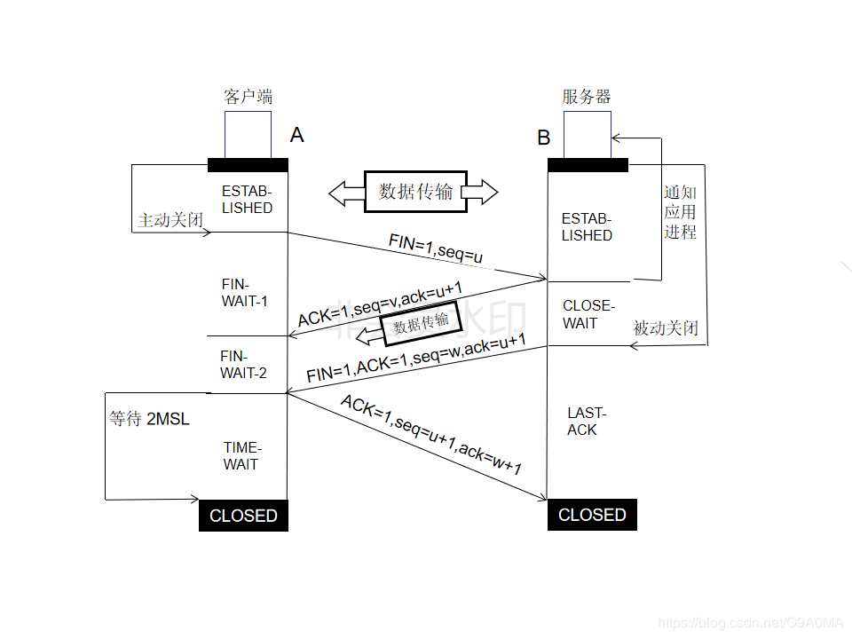

# 计算机网络体系结构

.png)

**NOTE:理解关键，模型从下到上，越接近用户**

## 各层作用

应用层：允许访问OSI环境的手段（应用协议数据单元APDU

表示层：对数据进行翻译、加密和压缩（表示协议数据单元PPDU）

会话层：建立、管理和终止会话（会话协议数据单元SPDU）

传输层：提供端到端的可靠报文传递和错误恢复（段Segment）

网络层：负责数据包从源到宿的传递和网际互连（包PackeT）

数据链路层：将比特组装成帧和点到点的传递（帧Frame）

物理层：通过媒介传输比特,确定机械及电气规范（比特Bit）

## 各层对应协议

|   层   |                         协议                          |
| :----: | :---------------------------------------------------: |
| 应用层 |     HTTP，SMTP，POP3(接受文件)，FTP，远程终端协议     |
| 传输层 |                      TCP    UDP                       |
| 网络层 | IP协议（Internet Protool） ARP RARP(反向地址解析协议) |

# 数据报文的结构

应用程序+TCP/UDP报文头部+IP报文头部(到这是以太网帧，46-1500)+以太网头部；

# TCP报文头部结构

（前20字节固定）16为源端口号+16位目的端口号+32位序号+32位确认号+4位头部长度（单位4字节）+6位保留+6个关键字（SYN,ACK，FIN）+16位窗口大小（指接收窗口）+16位校验和+16位紧急指针+最多40字节的选项；

# UDP报文头部结构首部字段

UDP报文头部结构首部字段只有 8 个字节，包括源端口、目的端口、长度、检验和。

# IP报文头部结构

4位版本+4位首部长度（单位4字节）+8位服务类型+16位总长度（字节）

16位标识（分组）+3位标志（是否分组）+13位片内偏移

8位TTL+8位上层协议+16位首部检验和

32位源IP地址

32位目的IP地址

 

# 以太网头部

**6**字节目的地址+6字节源地址+2字节类型。这个地址指MAC地址。

# 点对点和端对端的区别

​		点到点通信是针对数据链路层或网络层来说的，因为数据链路层只负责直接相连的两个节点之间的通信，一个节点的数据链路层接受ip层数据并封装之后，就把数据帧从链路上发送到与其相邻的下一个节点。 它是基于MAC地址和或者IP地址，是指一个设备发数据给与该这边直接连接的其他设备，这台设备又在合适的时候将数据传递给与它相连的下一个设备，通过一台一台直接相连的设备把数据传递到接收端。

​		端到端通信是针对传输层来说的，传输层为网络中的主机提供端到端的通信。因为无论tcp还是udp协议，都要负责把上层交付的数据从发送端传输到接收端，不论其中间跨越多少节点。只不过tcp比较可靠而udp不可靠而已。所以称之为端到端，也就是从发送端到接收端。它是一个网络连接，指的是在数据传输之前，在发送端与接收端之间（忽略中间有多少设备）为数据的传输建立一条链路，链路建立以后，发送端就可以发送数据。

# IP数据报传输的过程

​	(无论怎么传，IP地址源地址和目的地址是不会变的，但MAC目的和源地址会变)
​	IP数据报需从主机A上传送到主机B上，主机A首先查找路由表;

if(目的主机是与自己在同一个网段内)
	主机A查询自己的ARP表;如果存在目的IP地址到MAC的映射，将MAC地址作为目的MAC地址封装成帧，发给主机B.如果没有，发送ARP请求广播给网段内的所有主机，来查询该目的IP地址的MAC地址

else if(发现了能与目的网络号相匹配的表目)
	则把报文发给该路由表目指定的下一站的路由器或直接连接的网络接口;
	报文发送到下一站时，数据帧的目的MAC地址是下一个站路由器或者网络接口的MAC地址，而IP头部的目的IP	地址是主机B的IP地址;

else
	寻找标为“默认”的表目，把报文发送给该表目指定的下一站路由器;

# 各层对应硬件设备

网络层	    ：路由器，防火墙

数据链路层：网卡，网桥，交换机

物理层：    ：中继器，集线器

# IP协议作用

把各种数据包传送给对方。需要满足的最重要的两个条件是：IP地址和MAC地址。

IP地址指明了节点被分配到的地址，

MAC地址是指网卡所属的固定地址

# TCP、UDP异同

- 同

  都是传输层协议，都能都是保护网络层的传输，双方的通信都需要开放端口。

- 异

1、连接方面区别

TCP面向连接（如打电话要先拨号建立连接）。

UDP是无连接的，即发送数据之前不需要建立连接。

2、安全方面的区别

TCP提供可靠的服务，通过TCP连接传送的数据，无差错，不丢失，不重复，且按序到达。

UDP尽最大努力交付，即不保证可靠交付。

3、传输效率的区别

TCP传输效率相对较低。

UDP传输效率高，适用于对高速传输和实时性有较高的通信或广播通信。

4、连接对象数量的区别

TCP连接只能是点到点、一对一的。

UDP支持一对一，一对多，多对一和多对多的交互通信。

5、协议方面

TCP：FTP、Telnet、SMTP、POP3、HTTP

UDP：SNMP，TFTP

# TCP

## 一条TCP连接上发送数据速度的影响因素有哪些

1. 服务器到客户端之间带宽瓶颈
2. 客户端接收能力限制
3. 服务器网卡处理能力

## TCP粘包

TCP粘包就是指发送方发送的若干包数据到达接收方时粘成了一包，从接收缓冲区来看，后一包数据的头紧接着前一包数据的尾。

原因可能是发送方也可能是接收方造成的。

发送方原因：TCP默认使用**Nagle算法**，将多次间隔较小、数据量较小的数据，合并成一个数据量大的数据块，然后进行封包。

接收方原因：TCP将接收到的数据包保存在接收缓存里，然后应用程序主动从缓存读取收到的分组。这样一来，如果TCP接收数据包到缓存的速度大于应用程序从缓存中读取数据包的速度，多个包就会被缓存，应用程序就有可能读取到多个首尾相接粘到一起的包。

## 如何解决粘包问题

**如果多个分组毫不相干，甚至是并列关系，那么这个时候就一定要处理粘包现象了。**

处理方法：

发送方关闭**Nagle（纳格尔）**算法。

**接收方没有办法来处理粘包现象，只能将问题交给应用层来处理。应用层循环读取所有的数据，根据报文的长度判断每个包开始和结束的位置。**

## 为什么TCP有粘包，UDP没有？

​	TCP为了保证可靠传输并减少额外的开销（每次发包都要验证），采用了基于流的传输，基于流的传输不认为消息是一条一条的，是无保护消息边界的。

​	而UDP则是面向消息传输的，是有保护消息边界的，接收方一次只接受一条独立的信息，所以不存在粘包问题。

## 特点

(1)面向连接

(2)每条连接只能有两个端点

(3)TCP提供可靠交付

(4)TCP提供全双工通信

(5)面向字节流

## 可靠传输的工作原理

(1)停止等待协议

(2)连续APQ协议                           (APQ=automatic repeat request)

## 滑动窗口

### 作用

流量控制

流量控制：让发送方的发送速率不要太快，要让接收方来得及接收，点对点通信量的控制

## TCP的拥塞控制

### 定义

防止过多的数据注入到网络中，这样可以使网络中的路由器或者链路不至于过载；

前提是，网络能够承受现有的网络负荷

这是全局性的过程，设计所有主机+所有路由器+降低网络性能的所有因素

判断依据：出现了超时

发送方总是自己的发送窗口等于拥塞窗口

### 方法

#### 1.慢开始

先检测一下，也就是说，由小到大逐渐增大拥塞窗口的数量

初始化置为1，每经过一个**传输轮次**，拥塞窗口cwnd就**加倍**

#### 2.拥塞避免

思路和拥塞避免差不多，但是增长速率是每经过一次**往返时间**，拥塞窗口就**加一**

值得一提的是

**当cwnd<ssthresh时，使用慢开始算法。**

**当cwnd>ssthresh时，改用拥塞避免算法。**

**当cwnd=ssthresh时，慢开始与拥塞避免算法任意。**

#### 3.快重传

为了让发送方尽早知道个别报文段的丢失

要求接收方不要等待自己发送数据时才进行扫带确认，而是要立刻发送确认，即是收到了时序的报文段，也要立即发出对已收到的报文段的重复确认。

只要一连收到3个重复确认，就立即进行重传

#### 4.快恢复

当发送方知道只是丢失了个别的报文段，就不启动慢开始，而是执行快恢复算法，将门限值减半，拥塞窗口赋值为门限值大小，并开始执行拥塞避免算法

## 三次握手四次挥手

序号seq

确认号（ack）：期望收到对方下一个报文段的第一个数据字节的序号

确认ACK,确认标志位(ACKnowledgement)  仅当ACK=1时候确认号字段才有效。

同步SYN  (同步序列编号) (SYNchronization)在连接建立时用来同步序号

FIN：终止状态位，为1的时候表示次报文段的发送方的数据已发送完毕，并要求释放运输连接

### 三次握手

1. 准备工作，B先创建传输控制块（存储了连接的重要信息），准备接受客户进程的请求。然后服务器进程就处理监听状态，等待客户的连接请求。

2. 第一次握手，A创建传输控制模块TCB，然后，在打算建立TCP连接时，向B发出连接请求报文段，此时是同步位SYN=1，同时选择一个初始序号seq=x。此时A就进入了SYN-SENT（同步已发送）状态。

3. 第二次握手，B在收到连接请求报文段后，如果同意建立连接则向A发送确认,确认报文段中把SYN位和ACK位都置为1，确认号是ACK=x+1，同时为自己选择一个初始序号seq=y，这时候服务器进入SYN-RCVD（同步收到）状态

4. 第三次握手，客户端在收到B的确认后，还要向B给出确认，确认报文段的ACK置1，确认号ack=y+1,而自己的序号seq=x+1。这个时候，TCP连接已经建立，A进入ESTABLISHED（已建立连接状态），B收到A的确认后，也进入已建立连接状态

**注意:**SYN=1时候不能携带数据，但要消耗掉一个序号

### 为什么不能两次握手

防止已失效的连接请求报文段又传送到了服务器，因此产生了错误。

### 为什么不用四次握手

可以但没必要，可以把B发给A的分成两次，先发送一个确认报文段(ACK=1,ACK=x+1)

,然后再发同步报文段（SYN=1,seq=y）

# SYN攻击原理

​	SYN攻击属于DOS攻击的一种，它利用TCP协议缺陷，通过发送大量的半连接请求，耗费CPU和内存资源。

​	配合IP欺骗，SYN攻击能达到很好的效果，通常，客户端在短时间内伪造大量不存在的IP地址，向服务器不断地发送syn包，服务器回复确认包，并等待客户的确认，由于源地址是不存在的，服务器需要不断的重发直至超时，这些伪造的SYN包将长时间占用未连接队列，正常的SYN请求被丢弃，目标系统运行缓慢，严重者引起网络堵塞甚至系统瘫痪。

​	第一种是缩短SYN Timeout时间，由于SYN Flood攻击的效果取决于服务器上保持的SYN半连接数，这个值=SYN攻击的频度 x SYN Timeout，所以通过缩短从接收到SYN报文到确定这个报文无效并丢弃改连接的时间，例如设置为20秒以下（过低的SYN Timeout设置可能会影响客户的正常访问），可以成倍的降低服务器的负荷。

​	第二种方法是设置SYN Cookie，就是给每一个请求连接的IP地址分配一个Cookie，如果短时间内连续受到某个IP的重复SYN报文，就认定是受到了攻击，以后从这个IP地址来的包会被一概丢弃。

​	可是上述的两种方法只能对付比较原始的SYN Flood攻击，缩短SYN Timeout时间仅在对方攻击频度不高的情况下生效，SYN Cookie更依赖于对方使用真实的IP地址，如果攻击者以数万/秒的速度发送SYN报文，同时利用SOCK_RAW随机改写IP报文中的源地址，以上的方法将毫无用武之地。

net.ipv4.tcp_syncookies = 1
net.ipv4.tcp_max_syn_backlog = 8192
net.ipv4.tcp_synack_retries = 2
分别为启用SYN Cookie、设置SYN最大队列长度以及设置SYN+ACK最大重试次数。

​	SYN Cookie的作用是缓解服务器资源压力。启用之前，服务器在接到SYN数据包后，立即分配存储空间，并随机化一个数字作为SYN号发送SYN+ACK数据包。然后保存连接的状态信息等待客户端确认。启用SYN Cookie之后，服务器不再分配存储空间，而且通过基于时间种子的随机数算法设置一个SYN号，替代完全随机的SYN号。发送完SYN+ACK确认报文之后，清空资源不保存任何状态信息。直到服务器接到客户端的最终ACK包，通过Cookie检验算法鉴定是否与发出去的SYN+ACK报文序列号匹配，匹配则通过完成握手，失败则丢弃。
net.ipv4.tcp_synack_retries是降低服务器SYN+ACK报文重试次数，尽快释放等待资源。
tcp_max_syn_backlog则是使用服务器的内存资源，换取更大的等待队列长度，让攻击数据包不至于占满所有连接而导致正常用户无法完成握手。

​	SYN Flood是当前最流行的DoS（拒绝服务攻击）与DDoS（分布式拒绝服务攻击）的方式之一，这是一种利用TCP协议缺陷，发送大量伪造的TCP连接请求，从而使得被攻击方资源耗尽（CPU满负荷或内存不足）的攻击方式。

### 四次挥手

1. 第一次挥手：A数据传输完毕需要断开连接，A的应用进程向其TCP发出连接释放报文段（FIN = 1,序号seq = u）,并停止再发送数据，主动关闭TCP连接，进入FIN-WAIT-1状态（终止等待1状态），等待B的确认。

2. 第二次挥手：B收到连接释放报文段后即发出确认报文段（ACK=1，确认号ack=u+1,序号seq=v）,B进入CLOSE-WAIT关闭等待状态,此时的TCP处于半关闭状态，A到B的连接释放。而A收到B的确认后，进入FIN-WAIT-2状态，等待B发出的连接释放报文段。

3. 第三次挥手：当B数据传输完毕后，B发出连接释放报文段（FIN = 1，ACK = 1，序号seq = w,确认号ack=u+1）,B进入LAST-ACK（最后确认）状态，等待A 的最后确认。

4. 第四次挥手：A收到B的连接释放报文段后，对此发出确认报文段（ACK = 1，seq=u+1，ack=w+1）,A进入TIME-WAIT（时间等待）状态。此时TCP未释放掉，需要经过时间等待计时器设置的时间2MSL后，A才进入CLOSE状态。

### 为什么需要四次挥手

因为TCP连接是全双工的网络协议，允许同时通信的双方同时进行数据的收发，同样也允许收发两个方向的连接被独立关闭，以避免client数据发送完毕，向server发送FIN关闭连接，而server还有发送到client的数据没有发送完毕的情况。所以关闭TCP连接需要进行四次握手，每次关闭一个方向上的连接需要FIN和ACK两次握手。  

### 为什么需要TimeWait

时长：两倍最长报文段寿命

1. 保证A发送的最后一个ACK报文段能够到达B

2. 防止已失效的连接请求报文段又传送到了服务器，因此产生了错误。

## 为什么会出现大量TIME-WAIT

​	在高并发短连接的TCP服务器上，当服务器处理完请求后立刻主动正常关闭连接。这个场景下会出现大量socket处于TIME_WAIT状态。

​	如果客户端的并发量持续很高，此时部分客户端就会显示连接不上。

## 为什么有的时候会出现无法发起新连接

​	正常的TCP客户端连接在关闭后，会进入一个TIME_WAIT的状态，持续的时间一般在1~4分钟，短时间内（例如1s内）进行大量的短连接，则可能出现这样一种情况：客户端所在的操作系统的socket端口和句柄被用尽，系统无法再发起新的连接！

​	解决方法：

​	**简单来说，就是打开系统的TIMEWAIT重用和快速回收。**

## TCP为什么需要心跳包

防止客户端不正常关闭，而服务器却仍在不必要的等待

# IP地址分类

# MTU

## 定义

用来通知对方所能接受数据服务单元的最大尺寸，说明发送方能够接受的有效载荷大小。 

## 作用

 是包或帧的最大长度，一般以字节记。如果MTU过大，在碰到路由器时会被拒绝转发，因为它不能处理过大的包。如果太小，因为协议一定要在包(或帧)上加上包头，那实际传送的数据量就会过小，这样也划不来。大部分操作系统会提供给用户一个默认值，该值一般对用户是比较合适的。 [2] 

# 怎么在前端实现网页跳转，用什么函数？

## onclick跳转

设置window的location.href属性
    οnclick="window.location.href='URL'"
    οnclick="location='URL'"

## 调用window的open方法

​    οnclick="window.open('URL','_blank');" // 在新窗口打开
​    οnclick="window.open('URL','_self');" // 覆盖当前页

## 标签跳转

 < a href="URL" target="_blank">Preface</a>   // 在新窗口打开
<a href="URL" target="_self">Preface</a>  // 覆盖当前页，target属性默认为_self，此处可省略

## 后台

req.getRequestDispatcher("ok.jsp").forward(req,resp)

req.sendRedirect("ok.jsp");//URL发生变化