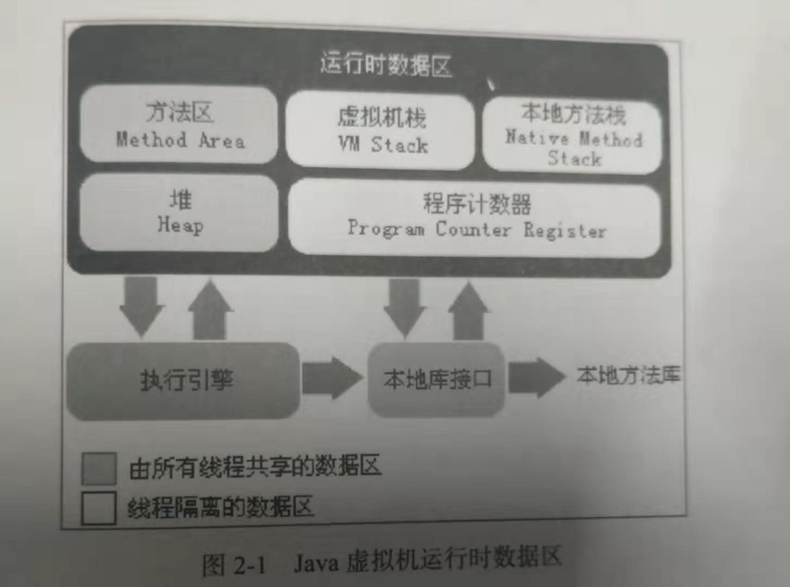

# 运行时数据区域

## 程序计数器

当前线程所执行的字节码的行号指示器，分支、循环、跳转、异常处理等都需要靠这个计数器来完成

## JAVA虚拟机栈

每个方法在执行的同时都会创建一个栈帧(Stack Frame)用来存储局部变量表、操作数栈、动态链接、方法出入口等信息。

## 本地方法栈

为Native方法服务的“JAVA虚拟机栈”

## JAVA堆

存放对象实例

可分为新生代（Eden空间、From Survivor 空间、To Survivor空间）和老年代

## 方法区

用来存储已被虚拟机加载的类信息、常量、静态变量等数据

## 运行常量池

方法区的一部分存放编译器生成的各种字面量和符号的引用

## 直接内存

内存对象分配在Java虚拟机的堆以外的内存，这些内存直接受操作系统管理（而不是虚拟机），这样做的结果就是能够在一定程度上减少垃圾回收对应用程序造成的影响。使用未公开的Unsafe和NIO包下ByteBuffer来创建堆外内存。

# 对象

## 创建过程

类加载检查机制：检查new指令的参数是否能在常量池中定位到一个类的符号引用，并且检查这个符号引用代表的								类是否已被加载、解析和初始化过。如果有，那必须先执行相应的类加载过程。

分配内存

设置对象头

执行</init/>方法

## 对象的内存布局

对象头	：存储对象本身的运行时数据（mark word）+（可以确定对象是那个类的实例的类型指针）

实例数据：程序代码中定义的各种类型的字段内容

（对象填充，仅起到占位符的作用）

# 常见错误

## 堆溢出OutOfMemoryError

对象无法申请到足够的内存造成的错误

## 栈溢出StackOverflowError

线程请求的站深度大于虚拟机所允许的最大深度

## 由常量池溢出扯出的String.intern()方法

intern方法返回的是常量池中记录首次出现的实例引用

# 常见的内存泄漏例子

1. 被放在了静态集合中

2. 各种连接没有释放，比如数据库连接，IO连接等

3. 监听器，使用了监听器，但是没有删除监听器

4. 变量不合理的作用域，通常是一个局部变量却被设置成了全局变量

   

# 引用等级

**强引用**

​	代码中普遍存在的，类似“Object obj=new Object()”这类的引用

**软引用**

​	有用但并非必须的对象，在系统要发生内存溢出异常之前，才会把这些对象列入回收范围之内

**弱引用**

​	非必须对象，只能生存到下一次垃圾回收之前

**虚引用**

​	在对象被收集器回收的时收到一个系统通知

# 堆快还是栈快？

​	JVM对堆栈只进行两种操作:以帧为单位的压栈和出栈操作。堆是应用程序在运行的时候请求操作系统分配给自己内存，由于从操作系统管理的内存分配,所以在分配和销毁时都要占用时间，因此用堆的效率非常低。