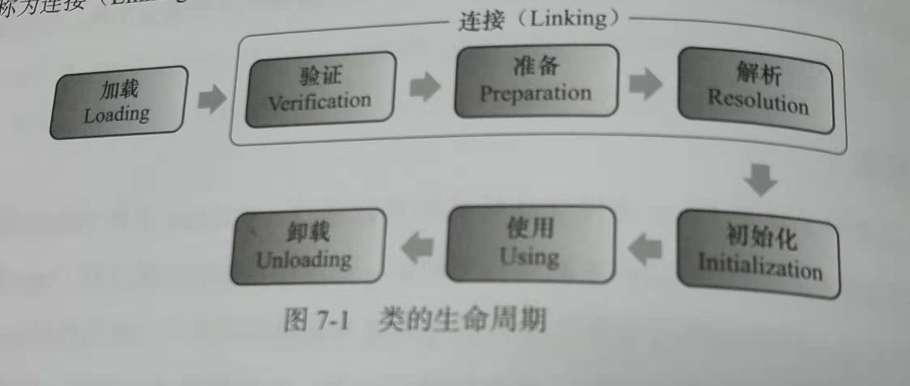
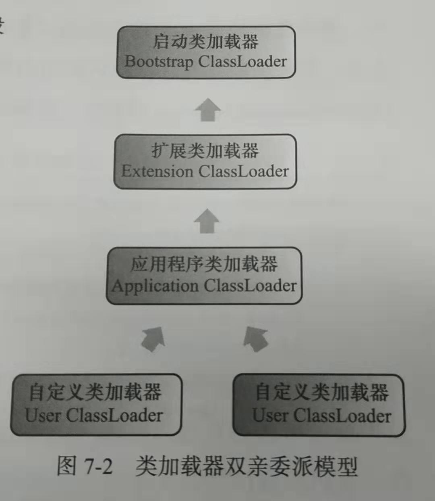

# 类加载机制/加载Class文件的原理机制是什么

把描述类的数据从Class文件加载到内存，并对数据进行校验、转换解析和初始化，最终形成可被虚拟机直接使用的Java类型

# 虚拟机什么时候才会加载Class文件并初始化类呢？

**类加载和初始化时机**

# 优点

JAVA语言，类型的加载、连接和初始化过程都是在程序运行期间完成的，这种策略虽然会让类加载增加性能开销，但是提供了高度的灵活性。

例如，编写一个面向连接的应用程序，可以等到运行时再指定其实际的实现类

​			用户可以通过Java预定义和自定义类加载器，让一个本地的应用程序可以在运行时从其他地方加载一个二进制流作为程序代码的一部分（JSP）

# 过程

加载、验证、准备、初始化和卸载这5个阶段是确定的，但是解析不一定，他在某种情况下可以在初始化后才开始。(为了支持java语言的运行时绑定。)

# 加载

加载阶段，需要完成3件事情

1. 通过一个类的全限定名来获取定义这个类的二进制字节流
2. 将这个字节流所代表的静态存储结构转化为方法区的运行时数据结构
3. 在内存中生成一个代表这个类的java.lang.Class对象，作为方法区这个类的各种数据的访问入口

# 验证

目的是为了确保Class文件的字节流中包含的信息符合当前虚拟机的要求，并且不会危害虚拟机自身的安全

分为四步：

1. 文件格式验证
2. 元数据验证
3. 字节码验证
4. 符号引用验证

# 准备

​	正式为类变量分配内存并设置类变量初始化的阶段，这些变量锁使用的内存都在方法区中分配。（这里指的是类静态变量，例如public static int value = 123;）

​	但准备阶段后的初始值为0而不是123，因为这个时候没有执行任何Java方法，而把value赋值为123的putstatic指令是程序被编译后，存放于类构造器<clinit>()方法照那个，所以把value赋值为123的动作将在初始化阶段才会执行。

​	在例外情况下，字段属性表存在ConstantValue属性（当变量被final修饰的时候），那在准备阶段变量value就会被初始化为ConstantValue属性所指定的值。

# 解析

解析阶段是虚拟机将常量池内的符号引用替换为直接引用的过程

# 初始化

​	    1) 遇到new、getstatic、putstatic或invokestatic这四条字节码指令

　　2) 使用java.lang.reflect包的方法对类进行反射调用的时候，如果类没有进行过初始化，则需要先触发其初始化。

　　3) 当初始化一个类的时候，如果发现其父类还没有进行过初始化，则需要先触发其父类的初始化。

　　4) 当虚拟机启动时，用户需要指定一个要执行的主类（包含main()方法的那个类），虚拟机会先初始化这个主类。

　　5) 当使用jdk1.7动态语言支持时，如果一个java.lang.invoke.MethodHandle实例最后的解析结果REF_getstatic,REF_putstatic,REF_invokeStatic的方法句柄，并且这个方法句柄所对应的类没有进行初始化，则需要先出触发其初始化。

# 类加载器

## 定义

实现“通过一个类的全限定名来获取描述词类的二进制字节流”这个动作的代码模块

## 类与类加载器

比较两个类是否相等，只有在这两个类是由同一个类加载器加载的前提下才有意义，然后要代表类的Class对象equals()方法，isAssignableFrom()方法、isInstance()方法的返回结果等。

## 双亲委派模型

### 类加载器分类

对于虚拟机，类加载器只有两种：

1. 一种是启动类加载器，是用C++实现的，是虚拟机的一部分
2. 所有其他类加载器，由Java语言实现，独立于虚拟机外部，并且都继承自抽象类java.lang.ClassLoader

### 工作过程

先检查是否被加载过，若没有加载则调用父加载器的loadClass()方法，若父加载器为空则默认使用启动类加载起作为父加载器，若父类加载失败，抛出ClassNotFoundException异常，再调用自己的findClass（）方法进行加载。

### 三种破坏双亲委派模型

1. JDK1.2前此模型未建立，在这之前继承ClassLoader的唯一目的就是为了重写loadClass()方法，因为虚拟机在进行类加载的时候回调用加载器的私有方法loadClassInternal()，而这个方法的唯一逻辑就是调用自己的loadClass()

2. 基础类又调用回用户的代码

   解决方法：线程上下文类加载器，它可以通过java.lang.Thread类的setContextClassLoader()方法进行设置，如果创建线程时未设置，它将从父线程中继承一个，如果在应用程序的全局范围内都没有设置过，那这个类加载器默认就是应用程序类加载器，可以达到父类加载器请求子类加载器去完成类加载器的行为。

3. 追求程序动态性导致的。

# Web服务器要解决类加载的问题

1. 部署在同一个服务器上的两个Web应用程序所使用Java类库可以实现相互隔离；
2. 部署在同一个服务器上的两个Web应用程序所使用的Java类库可以互共享；
3. 服务器需要尽可能地保证自身的安全不受部署的Web应用程序影响；
4. 支持JSP应用的Web服务器，大多数都需要支持HotSwap功能。

# Tomcat类加载器

1. 放在/common目录中				 ：类库可被Tomcat和所有的Web应用程序共同使用
2. 放在/serve目录中                       ：类库可被Tomcat使用，对所有的Web应用程序都不可见
3. 放在/shared目录中                    ：类库可被所有的Web应用程序共同使用，但对Tomcat自己不可见
4. 放在/WebApp/WEB-INF目录中：类库仅仅被此Web应用程序使用，对Tomcat和其他应用程序都不可见

# OSGi:灵活的类加载器架构

根本原因是用户对程序动态性的追求导致的，比如说热替换，简单来说就是机器不用重启，就可以直接使用

OSGi将按照下面的顺序进行类搜索：
1）将java.＊开头的类委派给父类加载器加载。
2）否则，将委派列表名单内的类委派给父类加载器加载。
3）否则，将Import列表中的类委派给Export这个类的Bundle的类加载器加载。
4）否则，查找当前Bundle的ClassPath，使用自己的类加载器加载。
5）否则，查找类是否在自己的Fragment Bundle中，如果在，则委派给Fragment Bundle的类加载器加载。
6）否则，查找Dynamic Import列表的Bundle，委派给对应Bundle的类加载器加载。
7）否则，类加载器失败。

